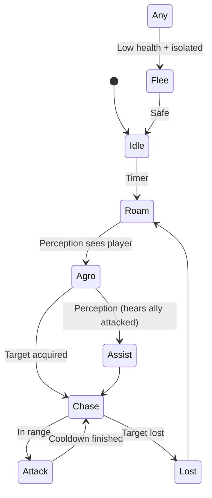
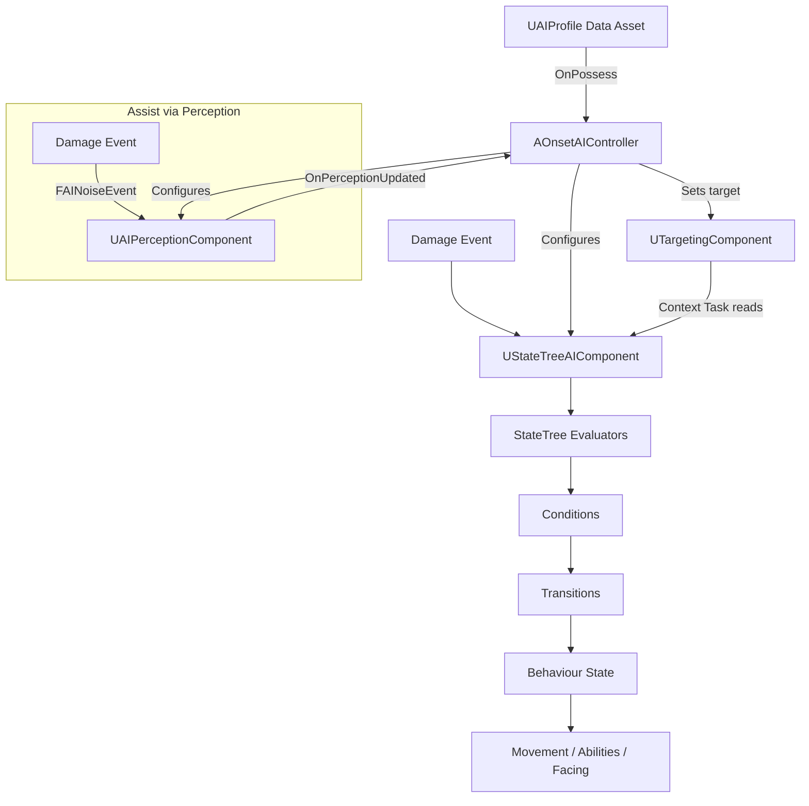

# 📘 **NPC AI SYSTEM — SYSTEM DOCUMENT**  
**File:** `/Docs/AI/NPC_AI_System.md`

---

# **NPC AI System**

## **Purpose**
The NPC AI System controls enemy behaviour using:

 - **StateTrees** (via `UStateTreeAIComponent`) for high‑level logic  
- **AI Perception** for detecting the player  
 - **[Group System](Group_System.md)** for group membership and attack alerts  
- **[GAS](../GAS/GAS_System.md)** for combat abilities  

It provides responsive, deterministic, multiplayer‑safe enemy behaviour.

---

## **Responsibilities**
- Manage NPC behaviour states:
  - Idle  
  - Roam  
  - Agro  
  - Chase  
  - Attack  
  - Flee  
  - Assist  
- Handle perception events  
- Select targets  
- Trigger abilities (GAS)  
- Move using AI navigation  
- React to damage and death  
- React to assist events via AI Perception hearing (noise from damage → `OnPerceptionUpdated`)  

---

## **Non‑Responsibilities**
- Spawning (handled by [Spawner System](Spawner_System.md))  
- Pooling (handled by [Pooling System](Pooling_System.md))  
- Ability definitions (handled by [GAS System](../GAS/GAS_System.md))  
- UI (handled by [UI System](../Gameplay/UI_System.md))  
- Animation montages  
- Multiplayer replication (handled by engine + [GAS System](../GAS/GAS_System.md) · see [Multiplayer System](../Multiplayer/Multiplayer_System.md))  

---

## **Key Classes**

### **`AOnsetEnemy`** (inherits `AOnsetBaseCharacter` — shared base with `AOnsetPlayerCharacter`)
- Base NPC pawn (`Onset/Source/Onset/Public/Enemy/`)
- Holds ASC, AttributeSet *(future)*
- Holds `UGroupComponent`
- Stores `FVector HomeLocation` — anchor point for territory-based Roam AI (set from spawn slot transform in `SpawnEnemyAtSlot`)
- Stores a `UAIProfile` reference, read by the controller on possession
- `ApplyProfile(UAIProfile*)` applies profile-driven visual/config to the pawn:
  - **Skeletal mesh path** — loads `SkeletalMesh` synchronously, sets mesh + anim BP + material; auto-sizes the capsule to `GetImportedBounds()` so targeting (`ECC_Visibility` traces) hits the capsule regardless of physics assets
  - **Cube fallback path** — when the profile has no `SkeletalMesh`, creates a `UStaticMeshComponent` (CubeVis) with `/Engine/BasicShapes/Cube.Cube`, sets `QueryAndPhysics` + `ECR_Block` on all channels so the cube itself blocks targeting traces and physics movement
  - **Pool return** — called with `nullptr`; destroys any existing CubeVis via `FindComponentByClass` + `DestroyComponent`, clears skeletal mesh/anim/material, hides the actor

### **`AOnsetAIController`** (`Onset/Source/Onset/Public/AI/`)
- Data‑driven base controller — no hardcoded enemy/player logic
- Owns `UStateTreeAIComponent`, `UAIPerceptionComponent`, and `UTargetingComponent` as subobjects
- On `OnPossess`, calls `StateTreeComp->StartLogic()` (profile-driven config applied by the spawner before possession)
- `ApplyProfile(const UAIProfile*)` loads the profile's StateTree asset and configures sight radius/angle and hearing range
- Includes authority guard — stops the StateTree on clients
- `bStartAILogicOnPossess = false` — lifecycle is manual (Spawner → ApplyProfile → Possess → StartLogic)

### **`UAIProfile`** (`Onset/Source/Onset/Public/AI/AIProfile.h`)
- `UDataAsset` subclass — created per enemy type in-editor
- Contains: `SkeletalMesh`, `AnimBlueprintClass`, `OverrideMaterial`, `StateTreeAsset`, sight range/angle, hearing range (acts as assist response radius), aggression, flee threshold  
- Designers create new enemy types without C++ changes
- All visual variation (mesh, animation, material) driven by profile — no Blueprint subclassing needed

### **`UOnsetStateTreeSchema`** (`Onset/Source/Onset/Public/AI/OnsetStateTreeSchema.h`)
- Defines context data (`FOnsetStateTreeContextData`) and the Global Task (`FOnsetStateTreeContextTask`) for the StateTree
- Context data includes: Self actor, CurrentTarget (from `TargetingComponent`), AssistTarget, group data, health, bAssistTriggered

### **StateTree Tasks** (`Onset/Source/Onset/Public/AI/Tasks/`)
- **`FOnsetStateTreeIdleTask`** — timer-based idle (3-8s), `FOnsetStateTreeIdleInstanceData` holds MinDuration/MaxDuration/RemainingTime
- **`FOnsetStateTreeRoamTask`** — territory patrol using `UNavigationSystemV1::GetRandomReachablePointInRadius()` anchored at `AOnsetEnemy::HomeLocation` (set from spawn slot transform in `SpawnEnemyAtSlot`), with `ADetourCrowdAIController` crowd avoidance enabled  

---

## **Key Functions (AOnsetAIController)**

### **`ApplyProfile(const UAIProfile*)`**
Reads the profile and self‑configures: loads the StateTree asset, sets perception configs, binds `OnPerceptionUpdated`.

### **`OnPerceptionUpdated(const TArray<AActor*>&)`**
Handles sight/hearing events — queries `GetCurrentlyPerceivedActors` for sight and hearing, finds the nearest valid enemy (skipping same-side actors via tag comparison), and sets `TargetingComponent.CurrentTarget`. Clears target when no enemies are perceived.  
**Hearing is the primary assist mechanism:** when an ally is damaged, a noise event broadcasts via `UAIPerceptionSystem`; each AI controller within its own `HearingRange` receives it here. The handler collects these noise sources alongside sight stimuli and feeds them into the same target acquisition flow. Group membership filtering for assist-specific logic is handled in the StateTree tasks.  

### **`SetTarget(AActor*)`** *(future)*
Assigns a target for chase/attack.

### **`OnDeath()`** *(future)*
Notifies spawner/pool.

---

## **StateTree Diagram**

Implemented tasks: `FOnsetStateTreeIdleTask`, `FOnsetStateTreeRoamTask`.  
Remaining tasks: Agro, Chase, Attack, Flee, Lost (all A3.3 — see `TODO/Private_Demo_Checklist.md`).

## **Data Flow Diagram**

> **Note:** Assist is not received directly from the Group System. Instead, damage emits a noise event via `UAIPerceptionSystem`. Each AI controller's `UAIPerceptionComponent` picks it up within `HearingRange` and the `OnPerceptionUpdated` handler filters by group identity.  

---

## **Interactions With Other Systems**

### **[Group System](Group_System.md)**
- Provides group membership for ally identification in `OnPerceptionUpdated`  
- Does not directly trigger AI state transitions — assist flows through AI Perception hearing  

### **[GAS](../GAS/GAS_System.md)**
- Executes abilities  
- Applies damage  
- Handles death  

### **[Spawner](Spawner_System.md) & [Pooling](Pooling_System.md)**
- Resets AI state  
- Reinitializes StateTree  

### **[Multiplayer](../Multiplayer/Multiplayer_System.md)**
- AI runs **server‑only**  
- Clients receive replicated movement + effects  

---

## **Replication Rules**
- AI logic runs **only on the server**  
- Target selection is server‑only  
- Movement is replicated  
- GAS handles ability replication  
- Perception is server‑only  

---

## **Edge Cases**
- NPC loses sight but is still in assist mode  
- NPC dies mid‑attack  
- NPC is pooled mid‑state  
- NPC target dies  
- Multiple assist events overlap  
- Player AI vs NPC AI interactions  

---

## **Testing Checklist**
- [ ] Perception triggers Agro  
- [ ] Assist (via perception hearing) triggers Agro  
- [ ] Chase transitions correctly  
- [ ] Attack triggers GAS ability  
- [ ] Flee triggers at low health  
- [ ] NPC resets correctly when pooled  
- [ ] Works in multiplayer (server‑only AI)  

---

## **Future Extensions**
- EQS‑based positioning  
- Ranged enemies  
- Boss behaviours  
- Threat evaluation system  
- Cover system  

---