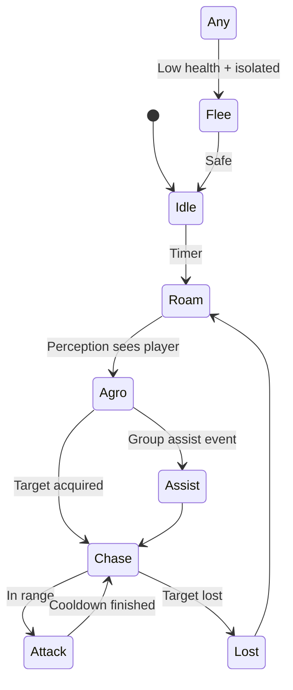
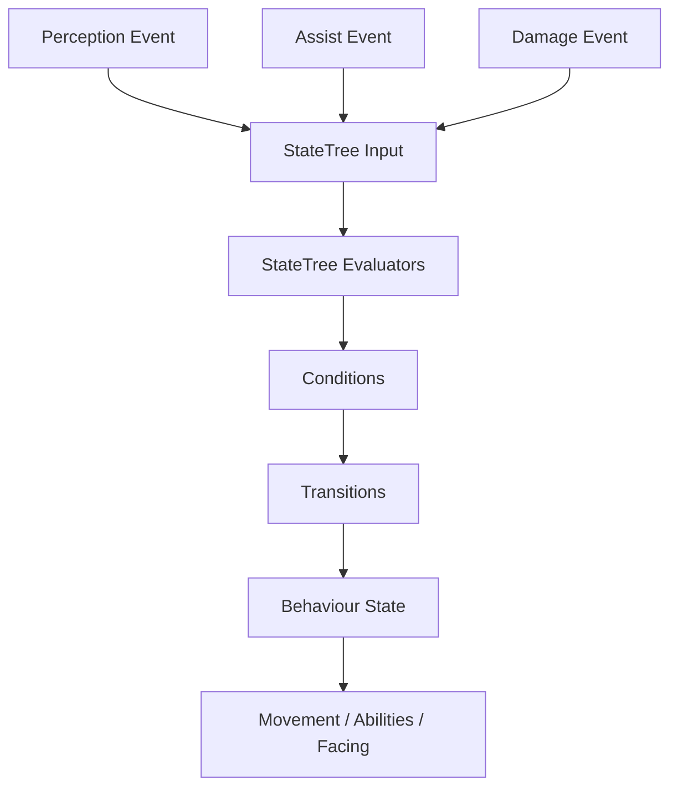

# 📘 **NPC AI SYSTEM — SYSTEM DOCUMENT**  
**File:** `/Docs/AI/NPC_AI_System.md`

---

# **NPC AI System**

## **Purpose**
The NPC AI System controls enemy behaviour using:

- **StateTrees** for high‑level logic  
- **AI Perception** for detecting the player  
- **[Group System](Group_System.md)** for assist behaviour  
- **[GAS](../GAS/GAS_System.md)** for combat abilities  

It provides responsive, deterministic, multiplayer‑safe enemy behaviour.

---

## **Responsibilities**
- Manage NPC behaviour states:
  - Idle  
  - Roam  
  - Agro  
  - Chase  
  - Attack  
  - Flee  
  - Assist  
- Handle perception events  
- Select targets  
- Trigger abilities (GAS)  
- Move using AI navigation  
- React to damage and death  
- Integrate with Group System for assist logic  

---

## **Non‑Responsibilities**
- Spawning (handled by [Spawner System](Spawner_System.md))  
- Pooling (handled by [Pooling System](Pooling_System.md))  
- Ability definitions (handled by [GAS System](../GAS/GAS_System.md))  
- UI (handled by [UI System](../Gameplay/UI_System.md))  
- Animation montages  
- Multiplayer replication (handled by engine + [GAS System](../GAS/GAS_System.md) · see [Multiplayer System](../Multiplayer/Multiplayer_System.md))  

---

## **Key Classes**

### **`ANPCCharacter`**
- Base NPC pawn  
- Holds ASC, AttributeSet  
- Holds StateTreeComponent  
- Holds PerceptionComponent  
- Holds GroupComponent  

### **`ANPCAIController`**
- Runs the StateTree  
- Handles perception events  
- Issues MoveTo commands  

### **`UNPCStateTreeSchema`**
- Defines context data for the StateTree  

### **`UNPCStateTreeComponent`**
- Executes the StateTree  
- Stores blackboard‑like data  

---

## **Key Functions**

### **`OnPerceptionUpdated()`**
Handles sight/hearing events.

### **`SetTarget(AActor*)`**
Assigns a target for chase/attack.

### **`EnterAgroState()`**
Triggered by perception or assist events.

### **`EnterAttackState()`**
Triggers GA_Attack.

### **`EnterFleeState()`**
Triggered by low health + isolation.

### **`OnDeath()`**
Notifies spawner/pool.

---

## **StateTree Diagram**

## **Data Flow Diagram**

---

## **Interactions With Other Systems**

### **[Group System](Group_System.md)**
- Receives assist events  
- Transitions into Agro  

### **[GAS](../GAS/GAS_System.md)**
- Executes abilities  
- Applies damage  
- Handles death  

### **[Spawner](Spawner_System.md) & [Pooling](Pooling_System.md)**
- Resets AI state  
- Reinitializes StateTree  

### **[Multiplayer](../Multiplayer/Multiplayer_System.md)**
- AI runs **server‑only**  
- Clients receive replicated movement + effects  

---

## **Replication Rules**
- AI logic runs **only on the server**  
- Target selection is server‑only  
- Movement is replicated  
- GAS handles ability replication  
- Perception is server‑only  

---

## **Edge Cases**
- NPC loses sight but is still in assist mode  
- NPC dies mid‑attack  
- NPC is pooled mid‑state  
- NPC target dies  
- Multiple assist events overlap  
- Player AI vs NPC AI interactions  

---

## **Testing Checklist**
- [ ] Perception triggers Agro  
- [ ] Assist events trigger Agro  
- [ ] Chase transitions correctly  
- [ ] Attack triggers GAS ability  
- [ ] Flee triggers at low health  
- [ ] NPC resets correctly when pooled  
- [ ] Works in multiplayer (server‑only AI)  

---

## **Future Extensions**
- EQS‑based positioning  
- Ranged enemies  
- Boss behaviours  
- Threat evaluation system  
- Cover system  

---