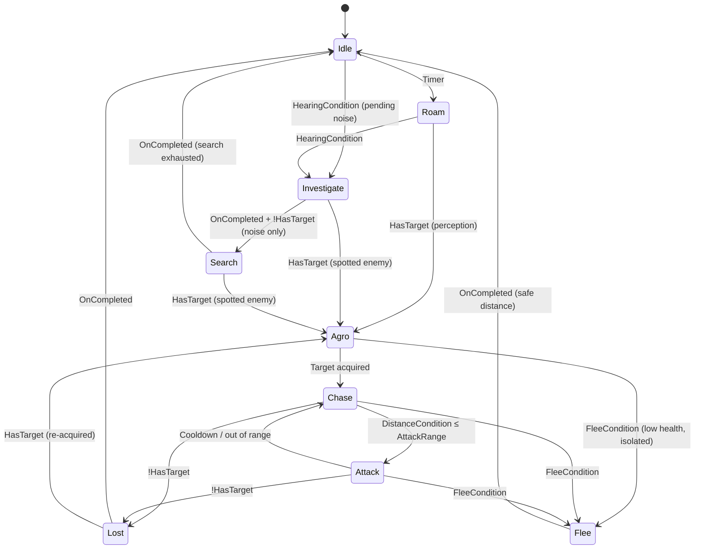
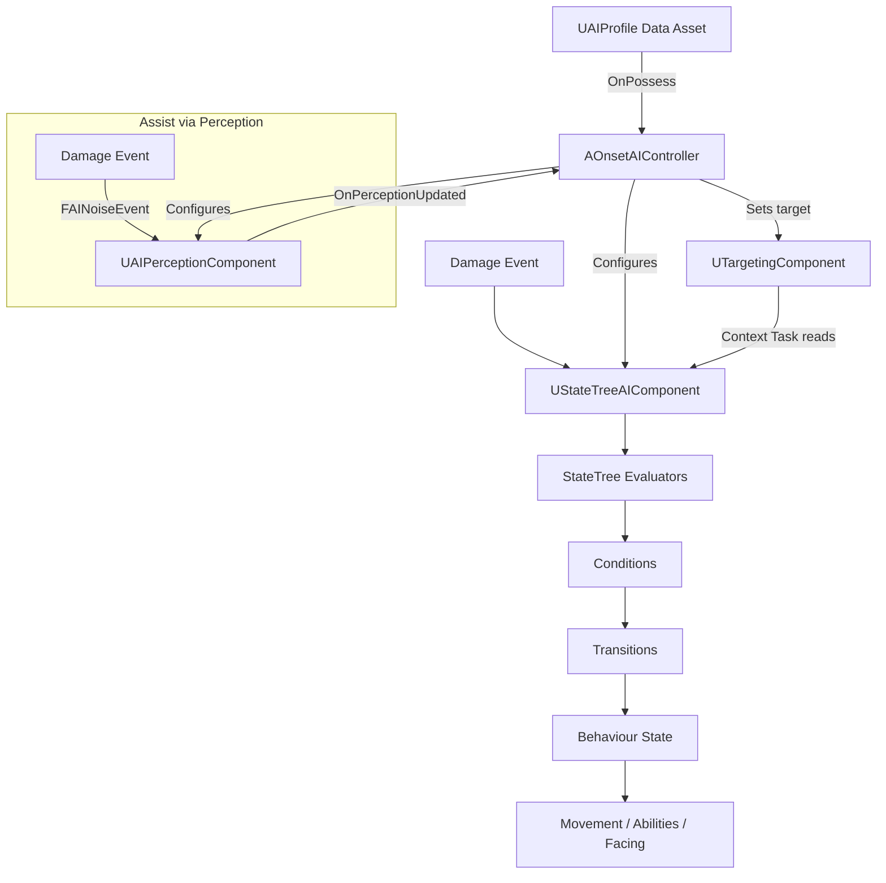

# 📘 **NPC AI SYSTEM — SYSTEM DOCUMENT**  
**File:** `/Docs/AI/NPC_AI_System.md`

---

# **NPC AI System**

## **Purpose**
The NPC AI System controls enemy behaviour using:

 - **StateTrees** (via `UStateTreeAIComponent`) for high‑level logic  
- **AI Perception** for detecting the player  
 - **[Group System](Group_System.md)** for group membership and attack alerts  
- **[GAS](../GAS/GAS_System.md)** for combat abilities  

It provides responsive, deterministic, multiplayer‑safe enemy behaviour.

---

## **Responsibilities**
- Manage NPC behaviour states:
  - Idle  
  - Roam  
  - Agro  
  - Chase  
  - Attack  
  - Flee  
  - Lost  
  - Assist  
- Handle perception events  
- Select targets  
- Trigger abilities (GAS)  
- Move using AI navigation  
- React to damage and death  
- React to assist events via AI Perception hearing (noise from damage → `OnPerceptionUpdated`)  
- Use [Threat System](Threat_System.md) for threat-driven target selection (overrides perception target when threat data exists)  
- Position around target using aggro rank for angular spread 

---

## **Non‑Responsibilities**
- Spawning (handled by [Spawner System](Spawner_System.md))  
- Pooling (handled by [Pooling System](Pooling_System.md))  
- Ability definitions (handled by [GAS System](../GAS/GAS_System.md))  
- UI (handled by [UI System](../Gameplay/UI_System.md))  
- Animation montages  
- Multiplayer replication (handled by engine + [GAS System](../GAS/GAS_System.md) · see [Multiplayer System](../Multiplayer/Multiplayer_System.md))  

---

## **Key Classes**

### **`AOnsetEnemy`** (inherits `AOnsetBaseCharacter` — shared base with `AOnsetPlayerCharacter`)
- Base NPC pawn (`Onset/Source/Onset/Public/Enemy/`)
- Holds `UAbilitySystemComponent`, `UOnsetAttributeSet`, `UOnsetMovementAttributeSet` (on shared base)
- Holds `UGroupComponent`
- `HomeTransform` inherited from `AOnsetBaseCharacter` — anchor for territory-based Roam AI (set from spawn slot transform in `SpawnEnemyAtSlot`); also usable for player respawn
- Stores three profile references: `UAIProfile* Profile`, `UVisualProfile* VisualProfile`, `UPerceptionProfile* PerceptionProfile`
- `ApplyProfile(UVisualProfile*)` applies visual profile to the pawn:
  - **Skeletal mesh path** — loads `SkeletalMesh` synchronously, sets mesh + anim BP + material; auto-sizes the capsule to `GetImportedBounds()`
  - **Cube fallback path** — when no `SkeletalMesh`, creates a `UStaticMeshComponent` (CubeVis) with `/Engine/BasicShapes/Cube.Cube`
  - **Pool return** — called with `nullptr`; clears all visuals, hides the actor

### **`AOnsetAIController`** (`Onset/Source/Onset/Public/AI/`)
- Data‑driven base controller — no hardcoded enemy/player logic
- Owns `UStateTreeAIComponent`, `UAIPerceptionComponent`, `USightConfig`, `UHearingConfig` as subobjects
- `UTargetingComponent` cached from pawn on `OnPossess`
- `ApplyAIProfile(const UAIProfile*)` — loads the profile's `StateTreeAsset`, stops/restarts StateTree logic
- `ApplyPerceptionProfile(const UPerceptionProfile*)` — configures `SightConfig.SightRadius`, `LoseSightRadius`, `PeripheralVisionAngleDegrees`, and `HearingConfig.HearingRange`
- Includes authority guard — stops the StateTree on clients
- `bStartAILogicOnPossess = false` — lifecycle is manual (Spawner → ApplyAIProfile → ApplyPerceptionProfile → Possess → StartLogic)

### **`UAIProfile`** (`Onset/Source/Onset/Public/Enemy/Profile/AIProfile.h`)
- `UDataAsset` subclass — created per enemy type in-editor
- Behaviour-only: `StateTreeAsset`, `Aggression`, `FleeThreshold`, `AssistRadius`, `AttackRange`, `ChaseRange`
- One of three focused data assets (`UAIProfile`, `UVisualProfile`, `UPerceptionProfile`) replacing the original monolithic `UAIProfile`

### **`UVisualProfile`** (`Onset/Source/Onset/Public/Enemy/Profile/VisualProfile.h`)
- `UDataAsset` subclass — visual configuration for the pawn
- Contains: `SkeletalMesh`, `CorpseMesh`, `AnimBlueprintClass`, `OverrideMaterial`

### **`UPerceptionProfile`** (`Onset/Source/Onset/Public/Enemy/Profile/PerceptionProfile.h`)
- `UDataAsset` subclass — perception configuration for the controller
- Contains: `SightRange`, `SightAngle`, `HearingRange`

### **`UOnsetStateTreeSchema`** (`Onset/Source/Onset/Public/AI/OnsetStateTreeSchema.h`)
- Defines context data (`FOnsetStateTreeContextData`) and the Global Task (`FOnsetStateTreeContextTask`) for the StateTree
- Context data includes: Self actor, CurrentTarget (from `TargetingComponent`), AssistTarget, group data, health, bAssistTriggered

### **`AOnsetBaseCharacter`** (`Onset/Source/Onset/Public/Player/`)
- Shared base for `AOnsetEnemy` and `AOnsetPlayerCharacter`
- Stores `FVector HomeLocation` — spawn anchor for territory-based AI and player respawn

### **StateTree Task Base** (`Onset/Source/Onset/Public/AI/Tasks/OnsetStateTreeTaskBase.h`)
- **`FOnsetStateTreeTaskBase`** — shared base struct, implements moved to `.cpp`. Provides static helpers accessed by every task:
  - `GetController(Context)` — `Cast<AOnsetAIController>(Context.GetOwner())`
  - `GetTarget(Context)` — `AIC->TargetingComponent->GetTarget()`
  - `GetSelfBaseCharacter(Context)` — `Cast<AOnsetBaseCharacter>(AIC->GetPawn())`
  - `GetSelfEnemyCharacter(Context)` — `Cast<AOnsetEnemy>(AIC->GetPawn())`
  - `GetPathFollowingComponent(Context)` / `HasMoveCompleted(Context)`
  - `ApplyMovementSpeedModifier(Self, Magnitude)` — applies infinite `MultiplyCompound` GE on `MovementSpeed` attribute, returns `FActiveGameplayEffectHandle`

### **StateTree Tasks** (`Onset/Source/Onset/Public/AI/Tasks/`)
- **`FOnsetStateTreeIdleTask`** — timer-based idle (3-8s)
- **`FOnsetStateTreeRoamTask`** — territory patrol via `GetRandomReachablePointInRadius()` anchored at `HomeTransform`
- **`FOnsetStateTreeAgroTask`** — face target via `SetFocus()`, succeeds on facing angle ≤ 15° + 0.5s duration
- **`FOnsetStateTreeChaseTask`** — `MoveToActor` with auto-repath; succeeds on arrival
- **`FOnsetStateTreeAttackTask`** — activates `GA_BasicAttack` on target via ASC, exits on cooldown
- **`FOnsetStateTreeFleeTask`** — projects flee point away from target (angle variance), applies `MovementSpeed` GE (health-ratio lerp, removed/re-applied per tick for dynamic speed), succeeds on arrival
- **`FOnsetStateTreeLostTargetTask`** — clear focus, random pause 2-4s
- **`FOnsetStateTreeInvestigateTask`** — moves to `HeardNoiseLocation`, applies `MovementSpeed` GE (group member vs non-group multiplier), succeeds on arrival or target sighted
- **`FOnsetStateTreeSearchTask`** — cone-restricted yaw sweep, oscillating focal point, MinCycles + MinSearchDuration dual exit, applies `MovementSpeed` GE (fixes speed leak — ExitState properly removes the GE)

### **StateTree Conditions** (`Onset/Source/Onset/Public/AI/Conditions/`)
- **`FOnsetStateTreeDistanceCondition`** — compares `DistSquared` between pawn and `CurrentTarget`/`HomeLocation` against squared threshold. Supports `EOnsetStateTreeDistanceSource` (AttackRange / ChaseRange) reading from `UAIProfile`. `bAllowNoTarget` flag for Lost-range fallback.
- **`FOnsetStateTreeFleeCondition`** — multi-factor: health ratio `<` flee threshold, group courage (allies within `AssistRadius` raise threshold), `FleeProbability` gate
- **`FOnsetStateTreeHearingCondition`** — gates Idle/Investigate by `bHasPendingNoise` + `MaxTimeSinceLastNoise` timeout
- **`FOnsetStateTreeTargetConditions`** — `HasTarget` / `HasNoTarget` shared empty instance data struct, inline implementations

### **Noise Event Flow**
Damage fires `UAISense_Hearing::ReportNoiseEvent` in `PostGameplayEffectExecute`. The controller stores:
- `HeardNoiseLocation`, `HeardNoiseInstigator`, `bHasPendingNoise`, `LastNoiseHeardTime`
- `OnPerceptionUpdated` sight branch sets `TargetingComponent`, hearing branch stores noise metadata
- `bHasPendingNoise` cleared on empty hearing array and on `SearchTask::EnterState` (enables re-investigation)

---

## **Key Functions (AOnsetAIController)**

### **`ApplyProfile(const UAIProfile*)`**
Reads the profile and self‑configures: loads the StateTree asset, sets perception configs, binds `OnPerceptionUpdated`.

### **`OnPerceptionUpdated(const TArray<AActor*>&)`**
Handles sight/hearing events — queries `GetCurrentlyPerceivedActors` for sight and hearing, finds the nearest valid enemy (skipping same-side actors via tag comparison), and sets `TargetingComponent.CurrentTarget`. Clears target when no enemies are perceived.  
**Hearing is the primary assist mechanism:** when an ally is damaged, a noise event broadcasts via `UAIPerceptionSystem`; each AI controller within its own `HearingRange` receives it here. The handler collects these noise sources alongside sight stimuli and feeds them into the same target acquisition flow. Group membership filtering for assist-specific logic is handled in the StateTree tasks.  

### **`SetTarget(AActor*)`** *(implemented via `UTargetingComponent`)*
Assigns a target for chase/attack.

### **`OnDeath()`** *(implemented in `AOnsetEnemy`)*
Notifies spawner/pool.

---

## **StateTree Diagram**

All tasks implemented. Health, perception hearing, and noise events handle assist/investigate/search logic.

## **Data Flow Diagram**

> **Note:** Assist is not received directly from the Group System. Instead, damage emits a noise event via `UAIPerceptionSystem`. Each AI controller's `UAIPerceptionComponent` picks it up within `HearingRange` and the `OnPerceptionUpdated` handler filters by group identity.  

---

## **Interactions With Other Systems**

### **[Group System](Group_System.md)**
- Provides group membership for ally identification in `OnPerceptionUpdated`  
- Does not directly trigger AI state transitions — assist flows through AI Perception hearing  

### **[GAS](../GAS/GAS_System.md)**
- Executes abilities  
- Applies damage  
- Handles death  

### **[Spawner](Spawner_System.md) & [Pooling](Pooling_System.md)**
- Resets AI state  
- Reinitializes StateTree  

### **[Multiplayer](../Multiplayer/Multiplayer_System.md)**
- AI runs **server‑only**  
- Clients receive replicated movement + effects  

---

## **Replication Rules**
- AI logic runs **only on the server**  
- Target selection is server‑only  
- Movement is replicated  
- GAS handles ability replication  
- Perception is server‑only  

---

## **Edge Cases**
- NPC loses sight but is still in assist mode  
- NPC dies mid‑attack  
- NPC is pooled mid‑state  
- NPC target dies  
- Multiple assist events overlap  
- Player AI vs NPC AI interactions  

---

## **Testing Checklist**
- [ ] Perception triggers Agro  
- [ ] Assist (via perception hearing) triggers Agro  
- [ ] Chase transitions correctly  
- [ ] Attack triggers GAS ability  
- [ ] Flee triggers at low health  
- [ ] NPC resets correctly when pooled  
- [ ] Works in multiplayer (server‑only AI)  

---

## **Future Extensions**
- EQS‑based positioning  
- Ranged enemies  
- Boss behaviours  
- Threat evaluation system  
- Cover system  

---