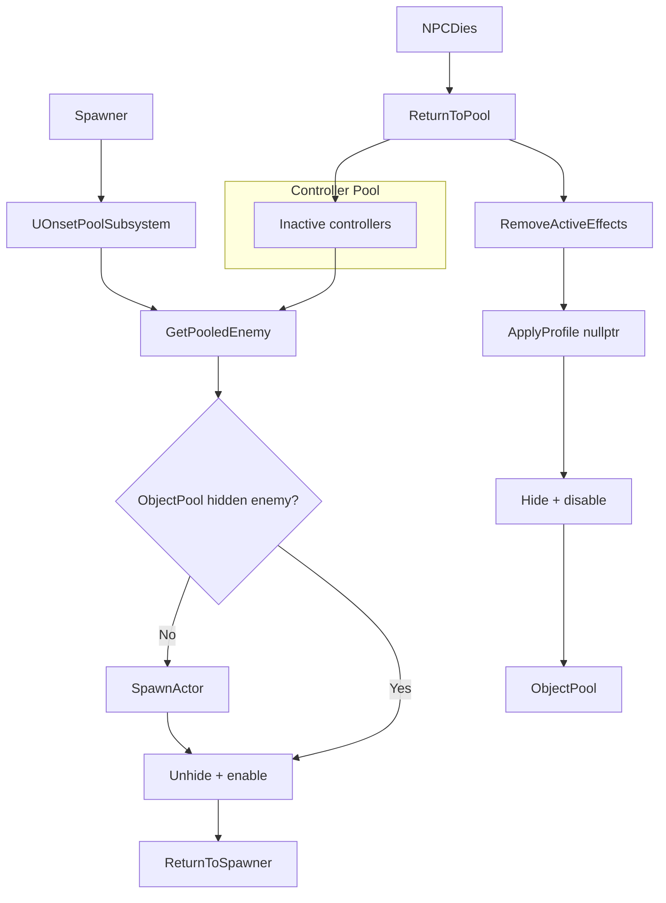

## 📘 Pooling System — `/Docs/AI/Pooling_System.md`

# **Pooling System**

## Purpose
Provide efficient reuse of NPC and controller instances to avoid frequent spawn/destroy calls and reduce runtime allocation overhead.

## Responsibilities
- Pre‑allocate NPC and controller instances  
- Hand out NPCs and controllers on request  
- Reset NPC and controller state on reuse  
- Return NPCs and controllers to pool on death/cleanup  
- Hand off world-debris lifecycle to the Corpse System on NPC death  

## Non‑Responsibilities
- Spawning logic (when/where)  
- AI behaviour  
- Combat logic  

## Key Classes
- **`UOnsetPoolSubsystem`** (`Onset/Source/Onset/Public/Spawning/`) — `UWorldSubsystem` replacing the old `AOnsetPoolManager`. Manages separate pools of enemies and controllers. Marked `UCLASS(Config=Onset)` for `UPROPERTY(Config)` members.  
  - `InitializePool()` — pre-allocates `PoolSize` enemies + controllers on world begin  
  - Config properties: `PoolSize` (default 10), `EnemyClass` (`AOnsetEnemy`), `ControllerClass` (`AOnsetAIController`)  

## Key Functions
- `GetPooledEnemy()` — finds hidden enemy, unhides, returns it; fallback spawns new one  
- `GetPooledController()` — finds hidden controller, unhides, enables StateTree + Perception ticks; fallback spawns new one  
- `ReturnToPool(AOnsetEnemy*)` — full reset sequence:
  1. Unregisters `UGroupComponent` from group manager  
  2. Unpossesses pawn via `ReleasePooledController → AIController->UnPossess()`  
  3. Removes all active GEs (`AbilitySystemComponent->RemoveActiveEffects`)  
  4. Calls `Enemy->ApplyProfile(nullptr)` to clear visuals  
  5. Nulls `OwningSpawner`, zeros location, hides, disables tick/collision/input  
  6. Adds to `ObjectPool` array  
- `ReleasePooledController(AOnsetAIController*)` — unpossesses, marks controller inactive  

## Data Flow



```
Spawner → UOnsetPoolSubsystem.GetPooledEnemy → Enemy + AIController
Enemy dies → ReturnToPool: remove GEs → clear visuals → hide → pool
Enemy dies → Corpse System.SpawnCorpse() (lightweight debris persists, parallel)
```

## Two-Tier Architecture
The pooling system operates in two tiers:

1. **AI Actor Pool** — Full NPCs with StateTree, Perception, AbilitySystemComponent, targeting. These are high-cost actors that recycle instantly into the pool when the NPC dies. Controllers are also pooled separately (their StateTree/Perception state is fully reset via `OnUnPossess`).
2. **Corpse Actor Pool** (or timed-life spawns) — Minimal `AOnsetCorpse` actors with a static mesh, no Tick, and a self-destruct timer. Created on death, destroyed after a lifespan, never block the AI pool.

This separation frees high-cost AI actors immediately on death while maintaining visual persistence in the world. The two lifecycles are independent — a corpse can outlive several pool-recycles of the same NPC type.

For full documentation, see the [Corpse System](Corpse_System.md).

## Interactions
- **[Spawner System](Spawner_System.md):** main consumer of pooled NPCs and controllers  
- **[NPC AI System](NPC_AI_System.md):** resets StateTree/AI state on `OnUnPossess`; clears `TargetingComponent`, noise state, `bHasPendingNoise`  
- **[Group System](Group_System.md):** `ReturnToPool` unregisters group membership  

## Replication
- Pooling is **server‑only**  
- Clients only see replicated NPCs as usual  

## Edge Cases
- Pool exhaustion — `GetPooledEnemy`/`GetPooledController` fallback to `SpawnActor`  
- NPC released while still referenced by AI — `OnUnPossess` clears all AI state  
- Incorrect reset — `ReturnToPool` sequence: unregister group → unpossess → remove GEs → clear visuals → hide  
- Speed leak on pool return — fixed by `RemoveActiveEffects` in `ReturnToPool` (clears any lingering MovementSpeed GEs)  

## Testing Checklist
- [ ] NPCs reset correctly (health, AI, visuals, GEs)  
- [ ] No stale targets or group data on reuse  
- [ ] No speed leak across pool cycles (MovementSpeed returns to base)  
- [ ] No crashes when pool is exhausted  
- [ ] Works under heavy spawn/respawn cycles  
- [ ] NPC returns to pool on death — hidden, collision off, tick off  
- [ ] Corpse spawns independently — pool return not blocked by corpse cleanup  
- [ ] Corpse cap enforced under rapid death cascade  
- [ ] Works in multiplayer (server‑only logic)  