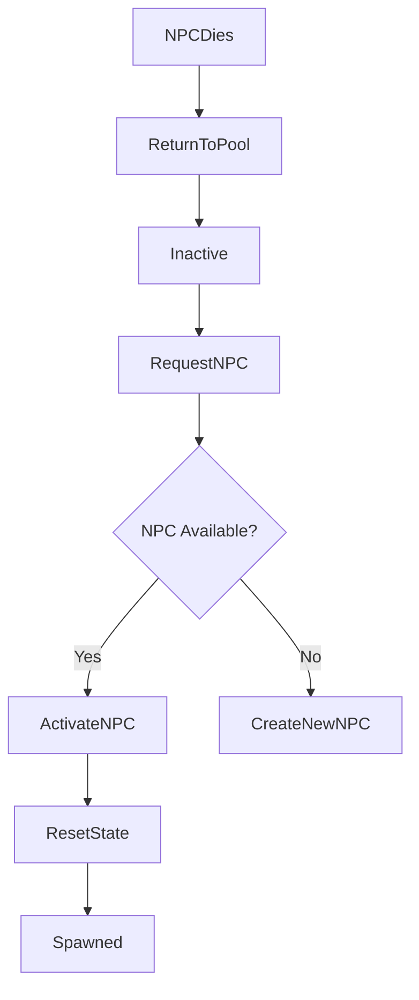

## 📘 Pooling System — `/Docs/AI/Pooling_System.md`

# **Pooling System**

## Purpose
Provide efficient reuse of NPC instances to avoid frequent spawn/destroy calls and reduce runtime allocation overhead.

## Responsibilities
- Pre‑allocate NPC instances  
- Hand out NPCs on request  
- Reset NPC state on reuse  
- Return NPCs to pool on death/cleanup  

## Non‑Responsibilities
- Spawning logic (when/where)  
- AI behaviour  
- Combat logic  

## Key Classes
- **`AOnsetPoolManager`** — owns and manages pooled NPCs; hardcodes `AOnsetEnemy::StaticClass()` for pre-allocation (no `PoolClass` property — all NPCs share the same base class)  

## Key Functions
- `GetPooledEnemy()` — returns an available NPC instance (creates new one on exhaustion as fallback)  
- `ReleasePooledEnemy(AOnsetEnemy*)` — returns NPC to pool  
- `ReturnToPool(AOnsetEnemy*)` — resets location, collision, state; calls `ApplyProfile(nullptr)` to clear profile-driven visuals  

## Data Flow

Spawner → PoolManager.GetPooledEnemy → NPC → (Death) → PoolManager.ReleasePooledEnemy

## Interactions
- **[Spawner System](Spawner_System.md):** main consumer of pooled NPCs  
- **[NPC AI System](NPC_AI_System.md):** must reset StateTree/AI state on reuse  
- **[Group System](Group_System.md):** must re‑register NPCs on reuse  

## Replication
- Pooling is **server‑only**  
- Clients only see replicated NPCs as usual  

## Edge Cases
- Pool exhaustion  
- NPC released while still referenced by AI  
- Incorrect reset (old target, old health, etc.)  

## Testing Checklist
- [ ] NPCs reset correctly (health, AI, visuals)  
- [ ] No stale targets or group data  
- [ ] No crashes when pool is exhausted  
- [ ] Works under heavy spawn/respawn cycles  