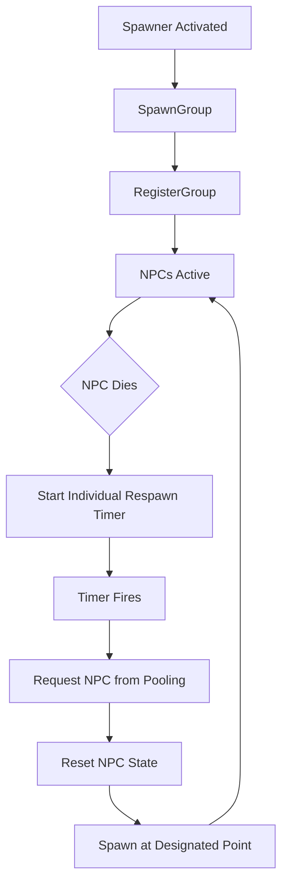

## 📘 Spawner System — `/Docs/AI/SpawnerSystem.md`

# **Spawner System**

## Purpose
Manage the creation and ongoing respawn of NPC groups in the world, assigning them to spawn points, groups, and initial states. Each NPC respawns independently on its own timer — the group does not wait for all members to die before respawning.

## Responsibilities
- Spawn NPCs in groups at predefined locations  
- Assign NPCs to Group System  
- Configure enemy types per spawn point  
- Assign a per-NPC respawn rate; each killed NPC respawns independently on its own timer  
- Expose simple controls (enable/disable, wave count, etc.)

## Non‑Responsibilities
- Individual AI behaviour  
- Combat logic  
- Object pooling internals  
- UI or wave presentation  

## Key Classes
- **`AEnemySpawner`** — main spawner actor placed in the level  
- **`FSpawnConfig`** — struct for enemy type, count, spacing, respawn rate, etc.  

## Key Functions
- `SpawnGroup()` — spawns or activates a group of NPCs  
- `OnNPCDeath(ANPC*)` — called when any single NPC dies; starts its individual respawn timer  
- `ScheduleRespawn(ANPC*)` — sets a per-NPC timer using the group respawn rate  
- `SpawnSingleNPC()` — respawns a single NPC at its designated point  
- `InitializeNPC(ANPC*)` — assigns group, type, initial state  

## Data Flow

Spawner → Pooling/GetNPC → NPC → (On death) → Spawner.OnNPCDeath → Timer → Spawner.SpawnSingleNPC

## Interactions
- **[Pooling System](Pooling_System.md):** requests NPC instances  
- **[Group System](Group_System.md):** registers members into groups  
- **[NPC AI System](NPC_AI_System.md):** starts in Idle/Roam  
- **Final Demo Loop:** may trigger waves via spawners  

## Replication
- Spawner logic is **server‑only**  
- Spawner state (active/inactive) may replicate if needed for UI  

## Edge Cases
- Spawner disabled mid-respawn — pending timers should cancel  
- No pooled NPCs available — retry after a short delay or queue the respawn  
- Respawn while player is too close (optional rule)  
- Multiple NPCs die simultaneously — each gets its own independent timer  

## Testing Checklist
- [ ] Spawns correct number and type of NPCs  
- [ ] Groups are registered correctly  
- [ ] Individual NPC respawns on its own timer after death  
- [ ] Respawn timers are independent — killing multiple NPCs does not cascade  
- [ ] Respawn rate config is respected  
- [ ] Works with pooling  
- [ ] Works in multiplayer (server‑only logic)  

---