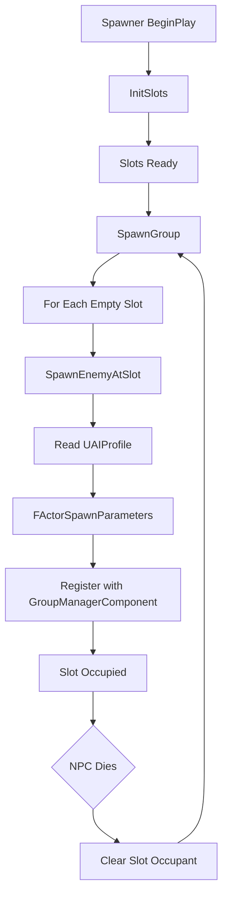

## 📘 Spawner System — `/Docs/AI/Spawner_System.md`

# **Spawner System**

## Purpose
Manage the creation and ongoing respawn of NPC groups in the world, assigning them to spawn points, groups, and initial states. Each NPC respawns independently on its own timer — the group does not wait for all members to die before respawning.

## Responsibilities
- Spawn NPCs in groups at predefined slot locations  
- Assign NPCs to Group System  
- Configure enemy types per slot via `UAIProfile`  
- Assign a per-NPC respawn rate; each killed NPC respawns independently on its own timer  
- Expose simple controls (enable/disable, wave count, etc.)

## Non‑Responsibilities
- Individual AI behaviour  
- Combat logic  
- Object pooling internals  
- UI or wave presentation  

## Key Classes
- **`AOnsetSpawner`** (`Onset/Source/Onset/Public/Spawning/`) — main spawner actor placed in the level  
- **`FSpawnConfig`** — struct for enemy profile, count, spacing, respawn rate, etc.  
- **`FSpawnerSlot`** (`Onset/Source/Onset/Public/Spawning/SpawnerSlot.h`) — struct pairing a spawn transform with an occupant reference  

## Key Functions
- `InitSlots()` — pre‑computes slot transforms from `SpawnPoints` or fallback ring scatter on `BeginPlay`  
- `SpawnGroup()` — fills all empty slots; calls `SpawnEnemyAtSlot()` for each  
- `SpawnEnemyAtSlot(int32 SlotIndex)` — retrieves an NPC from `PoolManager`, calls `ApplyProfile()` with the configured `UAIProfile`, registers it with the Group System. Requires a `PoolManager` — no direct `SpawnActor` fallback.  
- `DestroyGroup()` — iterates all slots, destroys any occupant, clears slot references  
- `DebugKillLast()` — kills the most recently spawned occupant (test helper)  
- `OnNPCDeath(AOnsetEnemy*)` — called when any single NPC dies; starts its individual respawn timer (future)  

## Data Flow

`AOnsetSpawner.InitSlots()` → `FSpawnerSlot[]` → `SpawnEnemyAtSlot(i)` → `PoolManager.GetPooledEnemy()` → `ApplyProfile(UAIProfile)` → `UGroupManagerComponent.RegisterMember()`

## Interactions
- **[Pooling System](Pooling_System.md):** requests NPC instances via `PoolManager->GetPooledEnemy()`; pool handles pre-allocation and exhaustion fallback  
- **[Group System](Group_System.md):** registers members into groups via `UGroupManagerComponent`  
- **[NPC AI System](NPC_AI_System.md):** pawn's `UAIProfile` configures controller on possess  
- **Final Demo Loop:** may trigger waves via spawners  

## Replication
- Spawner logic is **server‑only**  
- Spawner state (active/inactive) may replicate if needed for UI  

## Edge Cases
- Spawner disabled mid-respawn — pending timers should cancel  
- No pooled NPCs available — retry after a short delay or queue the respawn  
- Respawn while player is too close (optional rule)  
- Multiple NPCs die simultaneously — each gets its own independent timer  

## Testing Checklist
- [ ] Spawns correct number and type of NPCs  
- [ ] Slot transforms match spawn points or fallback scatter  
- [ ] Groups are registered correctly via `UGroupManagerComponent`  
- [ ] Individual NPC respawns on its own timer after death (future)  
- [ ] Respawn timers are independent — killing multiple NPCs does not cascade  
- [ ] DebugKillLast works  
- [ ] Works with pooling — pool pre-allocates, spawner always retrieves from pool  
- [ ] Works in multiplayer (server‑only logic)  

---