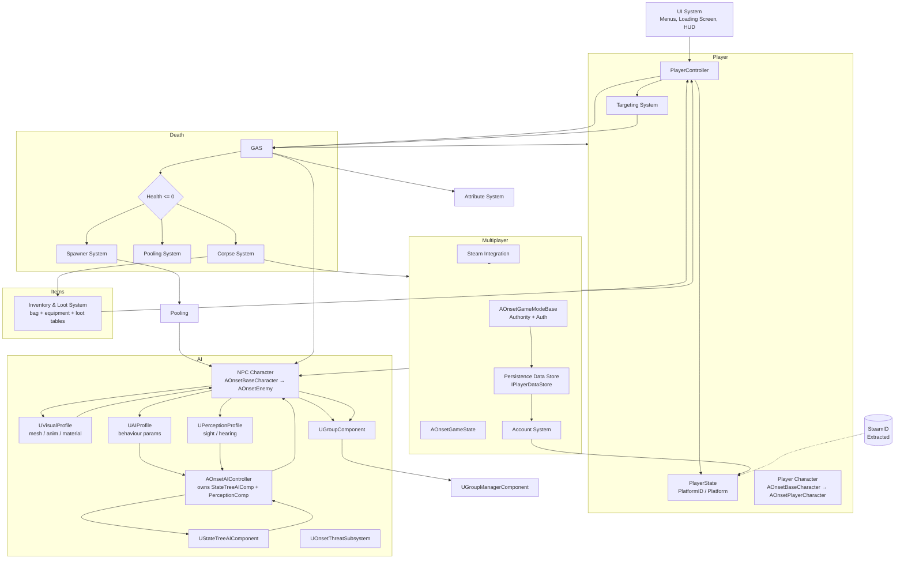

# 🧩 **ARCHITECTURE OVERVIEW**

## **High‑Level Architecture**
The project is composed of several modular systems that interact through clean, well‑defined boundaries:

- **[Player System](../Player/Player_System.md)**  
- **[NPC AI System](../AI/NPC_AI_System.md)**  
- **[Player AI System](../AI/Player_AI_System.md)**  
- **[Targeting System](../Gameplay/Targeting_System.md)**  
- **[Ability Targeting System](../Gameplay/Ability_Targeting_System.md)**  
- **[GAS (Gameplay Ability System)](../GAS/GAS_System.md)**  
- **[Spawner System](../AI/Spawner_System.md)**  
- **[Pooling System](../AI/Pooling_System.md)**  
- **[Group System](../AI/Group_System.md)**  
- **[Corpse System](../AI/Corpse_System.md)**  
- **[Threat System](../AI/Threat_System.md)**  
- **[Inventory & Loot System](../Inventory/Inventory_System.md)**  
- **[PvP System](../Gameplay/PVP_System.md)**  
- **[UI System](../Gameplay/UI_System.md)**  
- **[Multiplayer System](../Multiplayer/Multiplayer_System.md)**  
- **[Steam Integration System](../Steam/Steam_Integration_System.md)**  
- **[Persistence Data Store](../Server/Persistence_Data_Store.md)**  
- **[Account System](../Player/Account_System.md)**

Each system is responsible for a specific domain and communicates with others through explicit data flows.

---

# 🧱 **Architecture Diagram**

---

# 🧩 **System Interactions**

## **[Player System](../Player/Player_System.md) → [PvP System](../Gameplay/PVP_System.md)**
- UI toggle triggers `Server_SetPvPEnabled`  
- PlayerState stores and replicates PvP flag  

## **[PvP System](../Gameplay/PVP_System.md) → [Targeting System](../Gameplay/Targeting_System.md)**
- TargetingComponent filters out player actors when PvP is OFF  
- Auto‑target fallback ignores players when PvP is OFF  

## **[PvP System](../Gameplay/PVP_System.md) → [GAS System](../GAS/GAS_System.md)**
- Damage execution checks PvP flag  
- Blocks player→player damage when PvP is OFF  

## **[PvP System](../Gameplay/PVP_System.md) → [UI System](../Gameplay/UI_System.md)**
- UI displays PvP status  
- UI updates on `OnRep_PvPEnabled`  

## **[PvP System](../Gameplay/PVP_System.md) → [Player AI System](../AI/Player_AI_System.md)**
- Player AI ignores players when PvP is OFF  
- Player AI may target players when PvP is ON  

## **[PvP System](../Gameplay/PVP_System.md) → [Multiplayer System](../Multiplayer/Multiplayer_System.md)**
- PvP flag is server‑authoritative  
- Replicated to all clients  
- Cannot be spoofed client‑side  

---

# 🧠 **Updated Architecture Overview (Full Document)**

Below is the **complete updated Architecture Overview**, rewritten to include the PvP System cleanly and consistently.

---

# 📘 **TOP‑DOWN ARPG — ARCHITECTURE OVERVIEW**

## **Purpose**
Define the high‑level architecture of the Top‑Down ARPG AI Demo, including all major systems, their responsibilities, and how they interact.  
This document is the technical map for the entire project.

---

# 🧱 **Core Systems**

### **1. [Player System](../Player/Player_System.md)**
- `AOnsetBaseCharacter` as shared base (player + NPC)  
- `AOnsetPlayerCharacter` as player-specific class (camera)  
- `AOnsetPlayerController` handles all input, cursor, and targeting  
- `UInteractionComponent` — click resolution extracted from controller (SRP), handles raycast → enemy/ground branching  
- Input handling (mouse + touch + gamepad)  
- Tap/click‑to‑move + screen‑relative WASD + gamepad L-Stick movement  
- Tap/click‑to‑target via `UInteractionComponent`  
- Tap/click‑to‑loot corpses (range auto-path) via `UInteractionComponent`  
- Gamepad R-Stick software cursor  
- Ability activation (keyboard + touch buttons + gamepad)  
- PvP toggle UI → PlayerState  
- Autoplay handoff — possession swap to `AOnsetPlayerAIController`, replicated `bAutoplayEnabled`

### **2. [NPC AI System](../AI/NPC_AI_System.md)**
- Data‑driven via three focused profiles — `UVisualProfile` (mesh, anim, material), `UAIProfile` (StateTree + behaviour params), `UPerceptionProfile` (sight/hearing ranges)
- `AOnsetAIController` reads `UAIProfile` + `UPerceptionProfile` on possess and self‑configures  
- `AOnsetEnemy` reads `UVisualProfile` on spawn for mesh, anim BP, material  
- StateTree‑driven behaviour (owned by the controller, not the pawn)  
- Perception (sight/hearing) via component on the controller  
- Target selection  
- Combat behaviour  
- Assist logic via [Group System](../AI/Group_System.md)  

### **3. [Player AI System](../AI/Player_AI_System.md)**
- Autoplay/testing mode via AIController  
- StateTree‑driven movement, targeting, and ability usage  
- Target selection based on proximity/threat  
- Enables stress tests, demos, and debugging without human input

### **3b. [Authentication System](../Player/Account_System.md)**
- `UOnsetAuthSubsystem` — world subsystem, server-only, handles all auth logic
- Two modes (`[Onset.Auth] AuthMode`):
  - **Direct** (default) — Steam auth ticket validated inline via `ValidateAuthTicket()`, platform ID extracted from `FUniqueNetId`
  - **Token** — client presents HMAC-SHA256 signed token in URL (`?Token=...`), validated in `PreLogin`/`PostLogin`
- Session token system: `GenerateToken()` / `ValidateToken()` with configurable secret and lifetime
- `AOnsetLoginServerGameMode` — minimal game mode for login-only server: auth → token → kick
- Client reconnect: stores token via `Client_SessionToken` RPC, then `ReconnectToGameServer()` does `ClientTravel` with token in URL  
- World transitions are covered by a full-screen loading overlay (`UOnsetLoadingScreen`) shown before `ClientTravel` and hidden once the pawn replicates in (`OnRep_Pawn`)  

### **4. [Targeting System](../Gameplay/Targeting_System.md) (PvP‑aware)**
- Replicated `CurrentTarget` data holder with `IsActorTargetValid()` / `IsActorTargetPVPValid()` validation (see [Targeting System](../Gameplay/Targeting_System.md))
- Set by PlayerController context resolution (IA_Primary → raycast → branch)  
- AI targeting also feeds into TargetingComponent  
- PvP filtering  
- Provides target data to abilities
- Broadcasts `OnTargetChanged` to the HUD target widget  

### **5. [Ability Targeting System](../Gameplay/Ability_Targeting_System.md)**
- Single‑target, AoE, and directional targeting modes  
- Static library (`UAbilityTargetingLibrary`) reads current target from `UTargetingComponent`  
- Produces `FAbilityTargetData` (actor, location, direction) for GAS  

### **6. [GAS System](../GAS/GAS_System.md)**
- Ability execution  
- GameplayEffects  
- Cooldowns  
- Damage calculation  
- PvP damage filtering  

### **7. [Spawner System](../AI/Spawner_System.md)**
- Group spawning  
- Individual per‑NPC respawn logic  
- Enemy type assignment  

### **8. [Pooling System](../AI/Pooling_System.md)**
- NPC reuse  
- Resetting state on reuse  

### **9. [Group System](../AI/Group_System.md)**
- Group membership  
- Group center/direction  
- Assist behaviour  

### **10. [PvP System](../Gameplay/PVP_System.md)**
- Player‑controlled PvP toggle  
- Stored in PlayerState  
- Filters targeting  
- Filters damage  
- Replicated to all clients  

### **11. [UI System](../Gameplay/UI_System.md)**
- CommonUI screen stack (`UOnsetUISubsystem`, RootLayout + 3 layers) for login/character-select menus
- C++-driven character slots (`UCharacterSlot`)
- World-transition loading screen (`UOnsetLoadingScreen`)
- HUD, ability bar, health bars, target highlight, PvP toggle, loot overlay *(loot overlay implemented)*

### **12. [Multiplayer System](../Multiplayer/Multiplayer_System.md)**
- Server‑authoritative simulation  
- RPCs  
- Replication  
- Dedicated server support  

### **13. [Steam Integration System](../Steam/Steam_Integration_System.md)**
- Auth tickets  
- Server registration  
- Steam‑authenticated sessions

### **14. [Corpse System](../AI/Corpse_System.md)**
- Lightweight corpse actor spawned on NPC death  
- Timed despawn with hard cap  
- NPC returns to pool immediately (two-tier pooling architecture)  
- Loot container: corpses host a replicated `UOnsetInventoryComponent`; `OnDeath` rolls loot from `DT_Loot` into it; empty-loot corpses auto-expire after 4s
- Click-to-loot via `UInteractionComponent` (range-based auto-path, replicated `bLooted` double-loot guard, loot-overlay popup)

### **15. [Threat System](../AI/Threat_System.md)**
- Server-side threat table (`UOnsetThreatSubsystem`) driving NPC target selection
- Threat generated from damage, scaled by per-class and per-ability threat multipliers (Tank identity, taunt-style abilities)
- Angular spread around the target to prevent bunching

### **16. [Inventory & Loot System](../Inventory/Inventory_System.md)**
- Per-category item tables (`DT_Equipment` / `DT_QuestItems` / `DT_Junk` / `DT_Scrolls`) under a common `FOnsetItemDefinition` base
- Shared `UOnsetInventoryComponent` (stacked bag + equipped loadout + persistence), on player pawns and corpses
- Reusable loot tables (`DT_Loot`) with level/zone gating and recursive sub-table composition, rolled by `UOnsetLootLibrary::RollLoot`
- Scroll rows (ability-granting consumables) authored from the ability editor alongside abilities

---

# 🔗 **Full System Interaction Summary**

### **[Player System](../Player/Player_System.md) ↔ [PvP System](../Gameplay/PVP_System.md)**
- UI toggles PvP; PlayerState replicates PvP flag  

### **[PvP System](../Gameplay/PVP_System.md) ↔ [Targeting System](../Gameplay/Targeting_System.md)**
- Filters player targets  

### **[PvP System](../Gameplay/PVP_System.md) ↔ [GAS System](../GAS/GAS_System.md)**
- Blocks player→player damage  

### **[PvP System](../Gameplay/PVP_System.md) ↔ [UI System](../Gameplay/UI_System.md)**
- UI updates PvP status  

### **[PvP System](../Gameplay/PVP_System.md) ↔ [Player AI System](../AI/Player_AI_System.md)**
- Player AI ignores players when PvP OFF; may target when PvP ON  

### **[PvP System](../Gameplay/PVP_System.md) ↔ [Multiplayer System](../Multiplayer/Multiplayer_System.md)**
- Server enforces PvP rules; replicates PvP flag  

### **[Player System](../Player/Player_System.md) ↔ [Targeting System](../Gameplay/Targeting_System.md)**
- Click‑to‑target sets CurrentTarget  

### **[Player System](../Player/Player_System.md) ↔ [GAS System](../GAS/GAS_System.md)**
- Routes ability input → ASC  

### **[Player System](../Player/Player_System.md) ↔ [UI System](../Gameplay/UI_System.md)**
- HUD, ability bar, target highlight, PvP toggle  

### **[Player System](../Player/Player_System.md) ↔ [Player AI System](../AI/Player_AI_System.md)**
- Possession switching between PlayerController and PlayerAIController  

### **[Targeting System](../Gameplay/Targeting_System.md) ↔ [GAS System](../GAS/GAS_System.md)**
- Provides target data to abilities  

### **[Targeting System](../Gameplay/Targeting_System.md) ↔ [UI System](../Gameplay/UI_System.md)**
- Drives target highlight indicator  

### **[Ability Targeting System](../Gameplay/Ability_Targeting_System.md) ↔ [Targeting System](Targeting_System.md)**
- Reads CurrentTarget from `UTargetingComponent` to produce `FAbilityTargetData`

### **[Ability Targeting System](../Gameplay/Ability_Targeting_System.md) ↔ [GAS System](../GAS/GAS_System.md)**
- Provides `FAbilityTargetData` for ability execution  

### **[Ability Targeting System](../Gameplay/Ability_Targeting_System.md) ↔ [Player System](../Player/Player_System.md)**
- Player ability stubs call `UAbilityTargetingLibrary::GetTargetData()`

### **[Ability Targeting System](../Gameplay/Ability_Targeting_System.md) ↔ [NPC AI System](../AI/NPC_AI_System.md)**
- NPCs use same static library with their own TargetingComponent + pawn

### **[NPC AI System](../AI/NPC_AI_System.md) ↔ [GAS System](../GAS/GAS_System.md)**
- Executes abilities, applies damage, handles death  

### **[NPC AI System](../AI/NPC_AI_System.md) ↔ [Group System](../AI/Group_System.md)**
- NPC AI uses Group System for ally identification in `OnPerceptionUpdated`; assist response is triggered via AI Perception hearing, not directly from the Group System  

### **[NPC AI System](../AI/NPC_AI_System.md) ↔ [Spawner System](../AI/Spawner_System.md) & [Pooling System](../AI/Pooling_System.md)**
- Spawner applies all three profiles (`UVisualProfile`, `UAIProfile`, `UPerceptionProfile`) on spawn  
- Controller reads profiles on `OnPossess`, configures StateTree and perception  
- `ReturnToPool` resets AI state, removes GEs, clears visuals, hides actor  

### **[NPC AI System](../AI/NPC_AI_System.md) ↔ [Multiplayer System](../Multiplayer/Multiplayer_System.md)**
- AI runs server‑only; clients receive replicated movement + effects  

### **[Spawner System](../AI/Spawner_System.md) ↔ [Pooling System](../AI/Pooling_System.md)**
- Spawner requests pooled NPC + controller via `UOnsetPoolSubsystem.GetPooledEnemy()` / `GetPooledController()`  
- `ReturnToPool` returns NPC to inactive object pool after full state reset  

### **[Spawner System](../AI/Spawner_System.md) ↔ [Group System](../AI/Group_System.md)**
- Registers members into groups via `UGroupManagerComponent.RegisterMember()` in `SpawnEnemyAtSlot()`  

### **[Player AI System](../AI/Player_AI_System.md) ↔ [Targeting System](../Gameplay/Targeting_System.md)**
- Auto‑target selection for AI  

### **[Player AI System](../AI/Player_AI_System.md) ↔ [GAS System](../GAS/GAS_System.md)**
- Triggers abilities  

### **[Steam Integration System](../Steam/Steam_Integration_System.md) ↔ [Multiplayer System](../Multiplayer/Multiplayer_System.md)**
- Auth tickets for session authentication  

### **[Auth System](../Player/Account_System.md) ↔ [Persistence Data Store](../Server/Persistence_Data_Store.md)**
- `HandlePostLogin` loads/creates account via `UOnsetPlayerDataSubsystem`
- Token validation happens before account load (gate check in `PreLogin`)

### **[Auth System](../Player/Account_System.md) ↔ [Multiplayer System](../Multiplayer/Multiplayer_System.md)**
- Token auth mode validates session tokens in `PreLogin` before connection is accepted
- Login Server reuses same networking stack (Steam OSS) for auth ticket exchange

### **[Auth System](../Player/Account_System.md) ↔ [UI System](../Gameplay/UI_System.md)**
- Loading screen covers world travel after character select/creation

### **[Multiplayer System](../Multiplayer/Multiplayer_System.md) ↔ [Player System](../Player/Player_System.md)**
- Replicates player state; RPCs for PvP toggle, abilities, movement  

### **[Multiplayer System](../Multiplayer/Multiplayer_System.md) ↔ [NPC AI System](../AI/NPC_AI_System.md)**
- Replicates NPC state to clients; server‑authoritative AI execution

### **[GAS System](../GAS/GAS_System.md) ↔ [Corpse System](../AI/Corpse_System.md)**
- On death (Health ≤ 0), GAS fires a death event that triggers the corpse spawn
- Corpse spawn is parallel to pool return — not sequential

### **[Spawner System](../AI/Spawner_System.md) ↔ [Corpse System](../AI/Corpse_System.md)**
- Respawn timer starts at death, independent of corpse despawn
- Spawner does not wait for corpse cleanup before refilling a slot

### **[Pooling System](../AI/Pooling_System.md) ↔ [Corpse System](../AI/Corpse_System.md)**
- Two-tier architecture: AI actor pool recycles instantly, corpse actors have independent lifecycle
- Pool return does not block corpse spawn, and corpse despawn does not block pool retrieval  

### **[GAS System](../GAS/GAS_System.md) ↔ [Threat System](../AI/Threat_System.md)**
- Damage generates threat in `PostGameplayEffectExecute`, scaled by ability × class threat multipliers
- Ability multiplier travels on the effect context (set by `UOnsetGA_Generic`); class multiplier comes from `DT_ClassInfo` (`FOnsetCharacterClassInfo::ThreatMultiplier`)

### **[GAS System](../GAS/GAS_System.md) ↔ [Inventory & Loot System](../Inventory/Inventory_System.md)**
- Weapon-scaled abilities use equipped weapon `WeaponDamage` as `WeaponBase`
- Equipped defense (armor + shield) feeds damage mitigation via derived stats

### **[Corpse System](../AI/Corpse_System.md) ↔ [Inventory & Loot System](../Inventory/Inventory_System.md)**
- `AOnsetEnemy::OnDeath` rolls `Stats->LootTable` and stamps the corpse's inventory component
- Click-to-loot transfers loot to the player's bag and fires the loot overlay

### **[Player System](../Player/Player_System.md) ↔ [Inventory & Loot System](../Inventory/Inventory_System.md)**
- `UInteractionComponent::ProcessPrimaryInteraction` branches to `TryLootCorpse` on corpse clicks (range auto-path)
- `AOnsetPlayerController::Client_ShowLootOverlay` shows the just-looted items client-side

### **[Inventory & Loot System](../Inventory/Inventory_System.md) ↔ [UI System](../Gameplay/UI_System.md)**
- `ULootOverlayWidget` lists looted items (rarity-tinted) and auto-hides after 4s

### **[Inventory & Loot System](../Inventory/Inventory_System.md) ↔ [Persistence Data Store](../Server/Persistence_Data_Store.md)**
- Bag serializes as `{c, r, n}` array into `inventory_json`; equipment into `equipment_json`
- Restored on login via `FOnsetFullCharacterData`

---

# 🎯 **Final Notes**
The PvP System is intentionally lightweight and modular.  
It does not complicate AI, spawning, or pooling — it simply adds a **rules layer** on top of targeting and damage.

The Inventory & Loot System is equally additive: it attaches to the existing corpse lifecycle (roll → click-to-loot) and the existing persistence blobs (`inventory_json` / `equipment_json`), without touching AI, spawning, or pooling.

This keeps the architecture clean, predictable, and multiplayer‑safe.