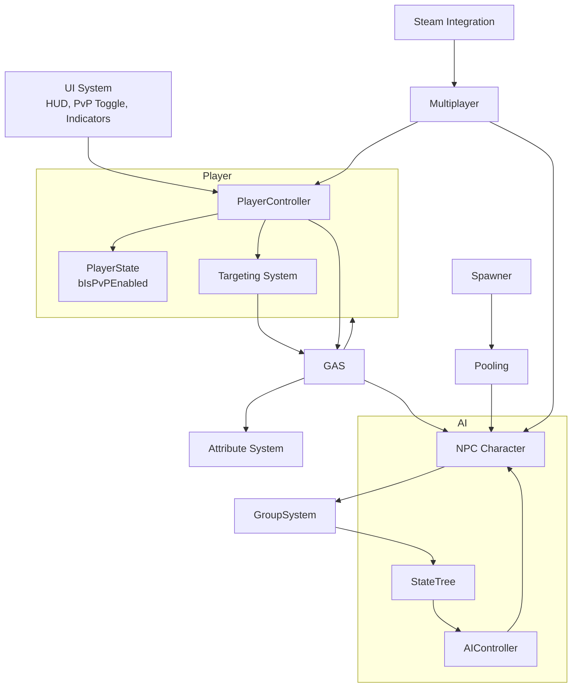

# 🧩 **ARCHITECTURE OVERVIEW**

## **High‑Level Architecture**
The project is composed of several modular systems that interact through clean, well‑defined boundaries:

- **[Player System](../Player/Player_System.md)**  
- **[NPC AI System](../AI/NPC_AI_System.md)**  
- **[Player AI System](../AI/Player_AI_System.md)**  
- **[Targeting System](../Gameplay/Targeting_System.md)**  
- **[Ability Targeting System](../Gameplay/Ability_Targeting_System.md)**  
- **[GAS (Gameplay Ability System)](../GAS/GAS_System.md)**  
- **[Spawner System](../AI/Spawner_System.md)**  
- **[Pooling System](../AI/Pooling_System.md)**  
- **[Group System](../AI/Group_System.md)**  
- **[PvP System](../Gameplay/PVP_System.md)**  
- **[UI System](../Gameplay/UI_System.md)**  
- **[Multiplayer System](../Multiplayer/Multiplayer_System.md)**  
- **[Steam Integration System](../Steam/Steam_Integration_System.md)**

Each system is responsible for a specific domain and communicates with others through explicit data flows.

---

# 🧱 **Architecture Diagram**

---

# 🧩 **Updated System Interactions (PvP Included)**

## **[Player System](../Player/Player_System.md) → [PvP System](../Gameplay/PVP_System.md)**
- UI toggle triggers `Server_SetPvPEnabled`  
- PlayerState stores and replicates PvP flag  

## **[PvP System](../Gameplay/PVP_System.md) → [Targeting System](../Gameplay/Targeting_System.md)**
- TargetingComponent filters out player actors when PvP is OFF  
- Auto‑target fallback ignores players when PvP is OFF  

## **[PvP System](../Gameplay/PVP_System.md) → [GAS System](../GAS/GAS_System.md)**
- Damage execution checks PvP flag  
- Blocks player→player damage when PvP is OFF  

## **[PvP System](../Gameplay/PVP_System.md) → [UI System](../Gameplay/UI_System.md)**
- UI displays PvP status  
- UI updates on `OnRep_PvPEnabled`  

## **[PvP System](../Gameplay/PVP_System.md) → [Player AI System](../AI/Player_AI_System.md)**
- Player AI ignores players when PvP is OFF  
- Player AI may target players when PvP is ON  

## **[PvP System](../Gameplay/PVP_System.md) → [Multiplayer System](../Multiplayer/Multiplayer_System.md)**
- PvP flag is server‑authoritative  
- Replicated to all clients  
- Cannot be spoofed client‑side  

---

# 🧠 **Updated Architecture Overview (Full Document)**

Below is the **complete updated Architecture Overview**, rewritten to include the PvP System cleanly and consistently.

---

# 📘 **TOP‑DOWN ARPG — ARCHITECTURE OVERVIEW**

## **Purpose**
Define the high‑level architecture of the Top‑Down ARPG AI Demo, including all major systems, their responsibilities, and how they interact.  
This document is the technical map for the entire project.

---

# 🧱 **Core Systems**

### **1. [Player System](../Player/Player_System.md)**
- Input handling  
- Click‑to‑move  
- Click‑to‑target  
- Ability activation  
- PvP toggle UI → PlayerState  
- Autoplay handoff  

### **2. [NPC AI System](../AI/NPC_AI_System.md)**
- StateTree‑driven behaviour  
- Perception (sight/hearing)  
- Target selection  
- Combat behaviour  
- Assist logic via [Group System](../AI/Group_System.md)  

### **3. [Player AI System](../AI/Player_AI_System.md)**
- Autoplay/testing mode via AIController  
- StateTree‑driven movement, targeting, and ability usage  
- Target selection based on proximity/threat  
- Enables stress tests, demos, and debugging without human input  

### **4. [Targeting System](../Gameplay/Targeting_System.md) (PvP‑aware)**
- Maintains `CurrentTarget`  
- Manual + automatic targeting  
- PvP filtering  
- Provides target data to abilities  

### **5. [Ability Targeting System](../Gameplay/Ability_Targeting_System.md)**
- Single‑target, AoE, and directional targeting modes  
- Mouse input interpretation for ability placement  
- Targeting indicators (circles, cones, etc.)  
- Provides `FAbilityTargetData` to GAS  

### **6. [GAS System](../GAS/GAS_System.md)**
- Ability execution  
- GameplayEffects  
- Cooldowns  
- Damage calculation  
- PvP damage filtering  

### **7. [Spawner System](../AI/Spawner_System.md)**
- Group spawning  
- Individual per‑NPC respawn logic  
- Enemy type assignment  

### **8. [Pooling System](../AI/Pooling_System.md)**
- NPC reuse  
- Resetting state on reuse  

### **9. [Group System](../AI/Group_System.md)**
- Group membership  
- Group center/direction  
- Assist behaviour  

### **10. [PvP System](../Gameplay/PVP_System.md)**
- Player‑controlled PvP toggle  
- Stored in PlayerState  
- Filters targeting  
- Filters damage  
- Replicated to all clients  

### **11. [UI System](../Gameplay/UI_System.md)**
- HUD  
- Ability bar  
- Health bars  
- Target highlight  
- PvP toggle  

### **12. [Multiplayer System](../Multiplayer/Multiplayer_System.md)**
- Server‑authoritative simulation  
- RPCs  
- Replication  
- Dedicated server support  

### **13. [Steam Integration System](../Steam/Steam_Integration_System.md)**
- Auth tickets  
- Server registration  
- Steam‑authenticated sessions

---

# 🔗 **Full System Interaction Summary**

### **[Player System](../Player/Player_System.md) ↔ [PvP System](../Gameplay/PVP_System.md)**
- UI toggles PvP; PlayerState replicates PvP flag  

### **[PvP System](../Gameplay/PVP_System.md) ↔ [Targeting System](../Gameplay/Targeting_System.md)**
- Filters player targets  

### **[PvP System](../Gameplay/PVP_System.md) ↔ [GAS System](../GAS/GAS_System.md)**
- Blocks player→player damage  

### **[PvP System](../Gameplay/PVP_System.md) ↔ [UI System](../Gameplay/UI_System.md)**
- UI updates PvP status  

### **[PvP System](../Gameplay/PVP_System.md) ↔ [Player AI System](../AI/Player_AI_System.md)**
- Player AI ignores players when PvP OFF; may target when PvP ON  

### **[PvP System](../Gameplay/PVP_System.md) ↔ [Multiplayer System](../Multiplayer/Multiplayer_System.md)**
- Server enforces PvP rules; replicates PvP flag  

### **[Player System](../Player/Player_System.md) ↔ [Targeting System](../Gameplay/Targeting_System.md)**
- Click‑to‑target sets CurrentTarget  

### **[Player System](../Player/Player_System.md) ↔ [GAS System](../GAS/GAS_System.md)**
- Routes ability input → ASC  

### **[Player System](../Player/Player_System.md) ↔ [UI System](../Gameplay/UI_System.md)**
- HUD, ability bar, target highlight, PvP toggle  

### **[Player System](../Player/Player_System.md) ↔ [Player AI System](../AI/Player_AI_System.md)**
- Possession switching between PlayerController and PlayerAIController  

### **[Targeting System](../Gameplay/Targeting_System.md) ↔ [GAS System](../GAS/GAS_System.md)**
- Provides target data to abilities  

### **[Targeting System](../Gameplay/Targeting_System.md) ↔ [UI System](../Gameplay/UI_System.md)**
- Drives target highlight indicator  

### **[Ability Targeting System](../Gameplay/Ability_Targeting_System.md) ↔ [GAS System](../GAS/GAS_System.md)**
- Provides FAbilityTargetData for ability execution  

### **[Ability Targeting System](../Gameplay/Ability_Targeting_System.md) ↔ [UI System](../Gameplay/UI_System.md)**
- Renders targeting indicators (circles, cones)  

### **[NPC AI System](../AI/NPC_AI_System.md) ↔ [GAS System](../GAS/GAS_System.md)**
- Executes abilities, applies damage, handles death  

### **[NPC AI System](../AI/NPC_AI_System.md) ↔ [Group System](../AI/Group_System.md)**
- Receives assist events; transitions into Agro  

### **[NPC AI System](../AI/NPC_AI_System.md) ↔ [Spawner System](../AI/Spawner_System.md) & [Pooling System](../AI/Pooling_System.md)**
- Resets AI state on respawn; reinitializes StateTree on reuse  

### **[NPC AI System](../AI/NPC_AI_System.md) ↔ [Multiplayer System](../Multiplayer/Multiplayer_System.md)**
- AI runs server‑only; clients receive replicated movement + effects  

### **[Spawner System](../AI/Spawner_System.md) ↔ [Pooling System](../AI/Pooling_System.md)**
- Requests NPC instances on respawn  

### **[Spawner System](../AI/Spawner_System.md) ↔ [Group System](../AI/Group_System.md)**
- Registers members into groups  

### **[Player AI System](../AI/Player_AI_System.md) ↔ [Targeting System](../Gameplay/Targeting_System.md)**
- Auto‑target selection for AI  

### **[Player AI System](../AI/Player_AI_System.md) ↔ [GAS System](../GAS/GAS_System.md)**
- Triggers abilities  

### **[Steam Integration System](../Steam/Steam_Integration_System.md) ↔ [Multiplayer System](../Multiplayer/Multiplayer_System.md)**
- Auth tickets for session authentication  

### **[Multiplayer System](../Multiplayer/Multiplayer_System.md) ↔ [Player System](../Player/Player_System.md)**
- Replicates player state; RPCs for PvP toggle, abilities, movement  

### **[Multiplayer System](../Multiplayer/Multiplayer_System.md) ↔ [NPC AI System](../AI/NPC_AI_System.md)**
- Replicates NPC state to clients; server‑authoritative AI execution  

---

# 🎯 **Final Notes**
The PvP System is intentionally lightweight and modular.  
It does not complicate AI, spawning, or pooling — it simply adds a **rules layer** on top of targeting and damage.

This keeps the architecture clean, predictable, and multiplayer‑safe.