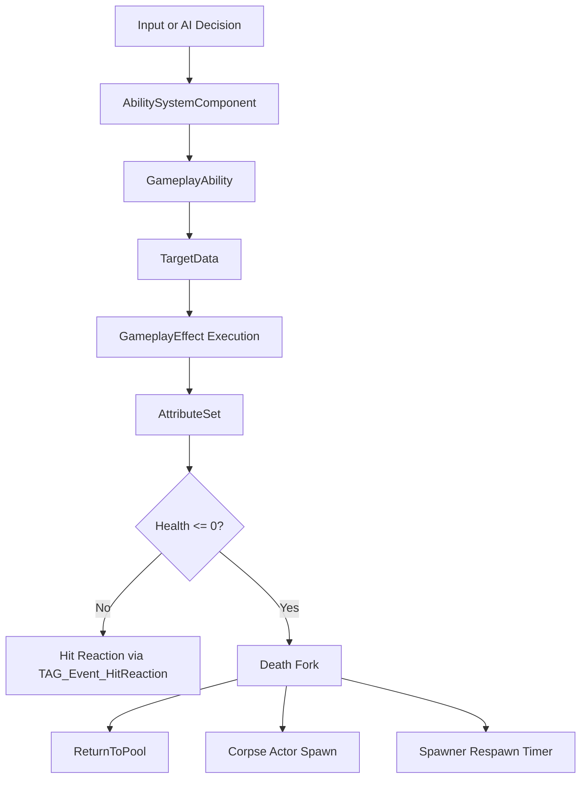

# 📘 **GAS SYSTEM DOCUMENT**  

---

# **GAS System**

## **Purpose**
Provide ability execution and attribute modification with PvP‑aware damage filtering.

---

## **Responsibilities**
- Execute abilities  
- Apply GameplayEffects  
- Replicate attribute changes  
- Enforce PvP damage rules  

---

## **Non‑Responsibilities**
- UI rendering (handled by [UI System](../Gameplay/UI_System.md))  
- AI decision‑making (handled by [NPC AI System](../AI/NPC_AI_System.md))  
- Target selection (handled by [Targeting System](../Gameplay/Targeting_System.md))  

---

## **Ability Flow Diagram**



---

## **PvP Damage Filtering**

### In Damage Execution Calculation:
```
if (Source is Player && Target is Player)
{
    if (!SourcePlayerState->bIsPvPEnabled)
    {
        // Block damage
        OutDamage = 0;
        return;
    }
}
```

### Applies to:
- Single‑target abilities  
- AoE abilities  
- Directional abilities  
- Projectile abilities  

### Does NOT apply to:
- NPC → Player damage  
- Player → NPC damage  

---

## **Targeting Integration**
If [Targeting System](../Gameplay/Targeting_System.md) rejects a player target due to PvP, GAS never receives invalid target data.

---

## **Key Classes**
- **`UAbilitySystemComponent`** — executes abilities, manages tags and effects  
- **`UGameplayAbility`** — base class for all abilities  
- **`UGameplayEffect`** — applies modifiers, damage, and cooldowns  
- **`UOnsetAttributeSet`** — defines combat attributes (Health, MaxHealth) — lives at `GAS/`  
- **`UOnsetMovementAttributeSet`** — defines movement attributes (MovementSpeed) with own `PostAttributeChange` — clamps ≥ 0 and syncs `MaxWalkSpeed` on `GetCharacterMovement()`. Dedicated set keeps movement concerns separate from combat. All speed modifiers apply via `MultiplyCompound` GEs.  

---

## **Source Location**
- All GAS files migrated from `Combat/` to `GAS/` directory: `OnsetAttributeSet.h/.cpp`, `OnsetMovementAttributeSet.h/.cpp`, `OnsetGameplayTags.h/.cpp`  

## **MovementSpeed Attribute (E22)**
- `UOnsetMovementAttributeSet` owns `MovementSpeed` as a replicated attribute
- `PostAttributeChange` clamps ≥ 0 and writes to `CharacterMovement->MaxWalkSpeed`
- Base value initialises from CDO default (`InitMovementSpeed(600.0f)`), overridable per BP Class Defaults
- All StateTree tasks apply speed modifiers via `ApplyMovementSpeedModifier` helper (creates infinite GE with `MultiplyCompound` op, returns `FActiveGameplayEffectHandle`)
- Speed effects stack multiplicatively by default (flee × stagger × search = compound)
- Pool return clears all active GEs via `RemoveActiveEffects`, preventing speed leaks  

## **Replication**
- Damage filtering occurs **server‑side only** via the [Multiplayer System](../Multiplayer/Multiplayer_System.md)  
- Clients receive replicated attribute changes  
- No client‑side prediction of [PvP System](../Gameplay/PVP_System.md) rules  

---

## **Testing Checklist**
- [ ] Abilities execute on input/AI trigger  
- [ ] Damage applies correctly  
- [ ] PvP filtering blocks player→player damage when OFF  
- [ ] AoE abilities respect PvP rules  
- [ ] Cooldowns work and replicate  
- [ ] Death triggers correctly (health ≤ 0)  
- [ ] Death fires both pool return and corpse spawn (two parallel paths)  
- [ ] MovementSpeed attribute initialises correctly at CDO default (600)  
- [ ] Flee/Investigate/Search tasks apply MovementSpeed GE correctly  
- [ ] Flee speed is dynamic — varies by health ratio each tick  
- [ ] MovementSpeed GEs stack multiplicatively (flee × stagger)  
- [ ] No speed leak on pool return — `RemoveActiveEffects` clears GEs  

---

## **Edge Cases**
- AoE overlaps players when PvP disabled  
- Player toggles PvP mid‑ability  
- Projectile fired before PvP toggle hits a player  