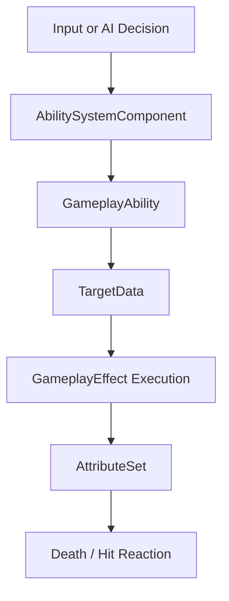

# 📘 **GAS SYSTEM DOCUMENT**  

---

# **GAS System**

## **Purpose**
Provide ability execution and attribute modification with PvP‑aware damage filtering.

---

## **Responsibilities**
- Execute abilities  
- Apply GameplayEffects  
- Replicate attribute changes  
- Enforce PvP damage rules  

---

## **Ability Flow Diagram**



---

## **PvP Damage Filtering**

### In Damage Execution Calculation:
```
if (Source is Player && Target is Player)
{
    if (!SourcePlayerState->bIsPvPEnabled)
    {
        // Block damage
        OutDamage = 0;
        return;
    }
}
```

### Applies to:
- Single‑target abilities  
- AoE abilities  
- Directional abilities  
- Projectile abilities  

### Does NOT apply to:
- NPC → Player damage  
- Player → NPC damage  

---

## **Targeting Integration**
If [Targeting System](../Gameplay/Targetting_System.md) rejects a player target due to PvP, GAS never receives invalid target data.

---

## **Replication**
- Damage filtering occurs **server‑side only** via the [Multiplayer System](../Multiplayer/Multiplayer_System.md)  
- Clients receive replicated attribute changes  
- No client‑side prediction of [PvP System](../Gameplay/PVP_System.md) rules  

---

## **Edge Cases**
- AoE overlaps players when PvP disabled  
- Player toggles PvP mid‑ability  
- Projectile fired before PvP toggle hits a player  