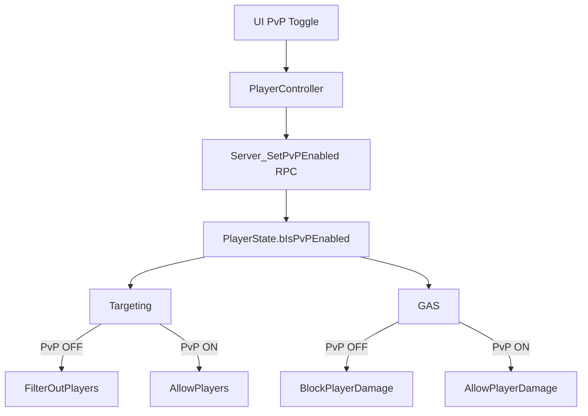

# 📘 **PvP SYSTEM DOCUMENT**  
**File:** `/Docs/Gameplay/PVP_System.md`

---

# **PvP System**

## **Purpose**
Provide a **player‑controlled PvP/PvE toggle** that determines whether a player can:

- Target other players  
- Damage other players  
- Be targeted by Player AI (optional)  

This system ensures **player agency** in multiplayer combat while keeping the rules deterministic and server‑authoritative.

---

## **Responsibilities**
- Store a replicated PvP flag per player  
- Provide UI controls for toggling PvP mode  
- Filter valid targets based on PvP state  
- Prevent player‑to‑player damage when PvP is disabled  
- Update UI and targeting indicators accordingly  

---

## **Non‑Responsibilities**
- NPC behaviour (NPCs always treat players as valid targets)  
- Ability logic (handled by [GAS System](../GAS/GAS_System.md))  
- UI rendering (handled by [UI System](UI_System.md))  

---

## **Key Classes**

### `AOnsetPlayerState`
Authoritative storage for:

```
bool bIsPvPEnabled;
```

Replicated to all clients.

### `AOnsetPlayerController`
- Receives UI toggle input  
- Sends `Server_SetPvPEnabled(bool)` RPC  

### `UTargetingComponent`
- `IsActorValidTarget()` filters player actors based on PvP flag (called by PlayerController during context resolution)  

### `UGameplayEffectExecution` / Damage Execution
- Blocks damage if PvP disabled  

---

## **Key Functions** *(planned)*

### AOnsetPlayerController
- `Server_SetPvPEnabled(bool)`  
- `OnRep_PvPEnabled()`  

### TargetingComponent (via AOnsetPlayerController)
- `IsActorValidTarget(AActor*)` called in PlayerController's context resolution  
  - Rejects players if PvP disabled  

### [GAS System](../GAS/GAS_System.md) Damage Execution
- `ShouldApplyDamage(Source, Target)`  
  - Blocks player→player damage if PvP disabled  

---

## **Data Flow Diagram**



---

## **Interactions**

### [Targeting System](Targeting_System.md)
- Filters out players when PvP disabled  
- Allows targeting players when PvP enabled  

### [GAS System](../GAS/GAS_System.md)
- Blocks damage to players when PvP disabled  

### [UI System](UI_System.md)
- Displays PvP toggle  
- Shows PvP status indicator  

### [Multiplayer System](../Multiplayer/Multiplayer_System.md)
- PvP flag is server‑authoritative  
- Replicates to all clients

---

## **Replication Rules**
- `bIsPvPEnabled` replicates via PlayerState  
- UI updates on `OnRep_PvPEnabled`  
- Server enforces all PvP rules  

---

## **Edge Cases**
- Player toggles PvP mid‑combat  
- Player has a player target when toggling PvP OFF  
- AoE abilities overlapping players  
- Player AI autoplay respecting PvP rules  

---

## **Testing Checklist**
- [ ] PvP toggle replicates correctly  
- [ ] Player cannot target players when PvP disabled  
- [ ] Player cannot damage players when PvP disabled  
- [ ] AoE abilities ignore players when PvP disabled  
- [ ] Player can target/damage players when PvP enabled  
- [ ] Works in multiplayer with multiple clients  

---

## **Future Extensions**
- PvP zones  
- PvP cooldown timer (anti‑toggle abuse)  
- PvP matchmaking  
- PvP ranking  
