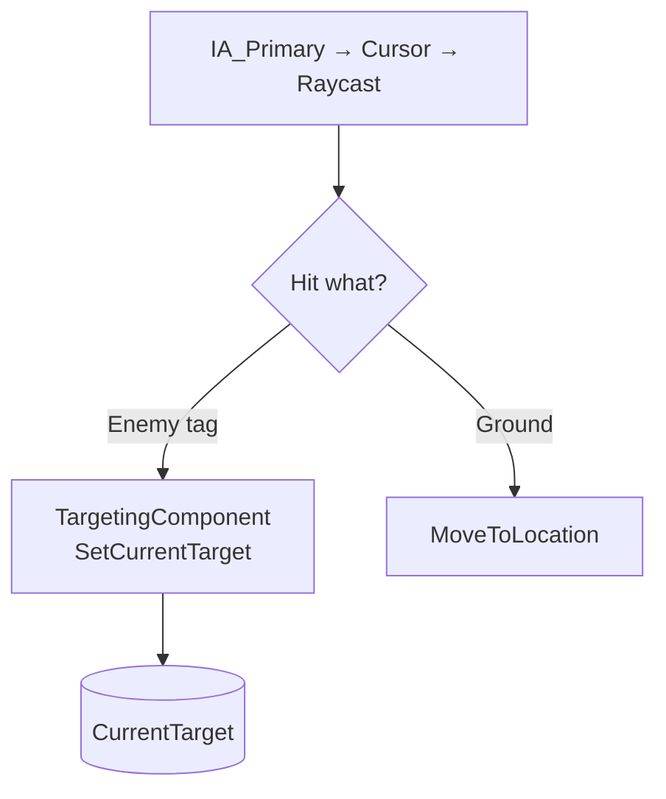

# 📘 **Targeting System Document**  
**File:** `/Docs/Gameplay/Targeting_System.md`

---

# **Targeting System**

## **Purpose**
Provide deterministic targeting for all actors using a **single authoritative target**, with PvP rules integrated into target validation.

> **Episode order note:** The targeting system is built for player use in A1.4 (after movement), before NPC spawning is added in A2. Testing can use temporary tagged actors.

---

## **Responsibilities**
- Maintain `CurrentTarget` (data holder with validation)  
- Manual targeting (player via IA_Primary context resolution in PlayerController)  
- Stub `IsActorValidTarget()` for future PvP‑aware target filtering  
- Provide target data for abilities (future)  
- Drive target highlighting UI (future)  

---

## **Target Selection Logic**

### **Player**
- IA_Primary on enemy → `SetCurrentTarget` (via PlayerController context resolution)  
- IA_Primary on ground → `MoveToLocation`  
- If PvP disabled → players are **not valid targets**  
- If PvP enabled → players become valid targets  

### **NPC**
- Always target players  
- PvP flag does **not** affect NPC behaviour  

---

## **Non‑Responsibilities**
- Ability‑specific targeting rules (handled by [Ability Targeting System](../Gameplay/Ability_Targeting_System.md))  
- Damage calculations (handled by [GAS System](../GAS/GAS_System.md))  
- UI rendering (handled by [UI System](UI_System.md))  

---

## **Key Classes**
- **`UTargetingComponent`** — data holder attached to player, maintains `CurrentTarget`, provides `IsActorValidTarget()` stub (validation planned for PvP integration)  

---

## **Targeting Flow Diagram**



## **Target Validation Rules**

### Valid target if: *(planned — not yet implemented)*
- Target is alive  
- Target is within range *(future)*  
- Target is visible (optional LOS) *(future)*  
- **PvP rules allow targeting** *(future)*  

### PvP Filtering *(future)*:
```
if (Target is Player && !SourcePlayer->bIsPvPEnabled)
    return false;
```

---

---

## **Replication** *(planned)*
- Target selection is **client‑side**  
- Server validates target data when ability activates via GAS  

---

## **Testing Checklist**
- [x] Click‑to‑target sets `CurrentTarget` (on tagged actors)  
- [ ] Auto‑target fallback selects nearest valid enemy *(planned)*  
- [ ] PvP filtering correctly excludes players when OFF *(planned)*  
- [ ] AI targeting respects PvP rules *(planned)*  
- [ ] Target highlight appears/disappears correctly *(planned)*  

---

## **Interactions**
- **[PvP System](PVP_System.md):** filters player targets  
- **[GAS System](../GAS/GAS_System.md):** validates damage  
- **[UI System](UI_System.md):** updates target highlight  
- **[Player System](../Player/Player_System.md):** sets target from input  

---

## **Edge Cases**
- Player toggles PvP OFF while targeting a player  
- AoE overlaps players when PvP disabled  
- Player AI must ignore players when PvP disabled  