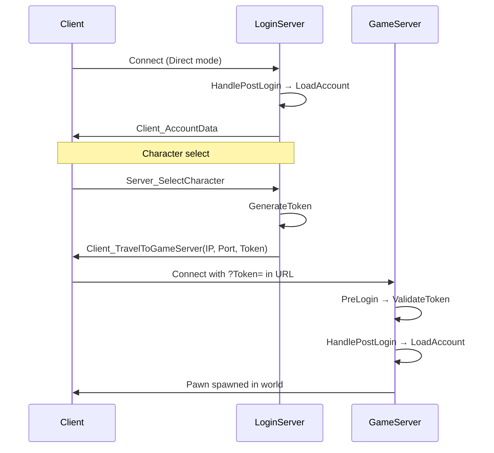

# 📘 **Multiplayer System**

## Purpose
Make the entire demo **server‑authoritative and multiplayer‑safe**, supporting dedicated servers and Steam‑authenticated sessions. Implements a **two‑server architecture** with a login server for auth + character select and a dedicated game server for gameplay.

## Responsibilities
- Define server/client authority rules  
- Ensure AI runs server‑only  
- Ensure abilities and effects replicate correctly  
- Support dedicated server builds  
- Integrate with Steam for authentication  

## Non‑Responsibilities
- Low‑level networking (engine)  
- Matchmaking UI  
- Anti‑cheat  

## Key Concepts

### Two‑Server Architecture
```
Client ──► Login Server (port 7777, AuthMode=Direct)
               │
               │ Account creation + character select
               │ Token generated on character select
               │
               ▼
Client ──► Game Server (port 7778, AuthMode=Token)
               │
               │ Token validated on PreLogin
               │ Pawn spawned, gameplay begins
```

| Server | Port | Auth Mode | Map | Purpose |
|--------|------|-----------|-----|---------|
| Login | 7777 | Direct | `/Game/Maps/LoginServer` | Authenticate, account load, character select |
| Game | 7778 | Token | `/Game/Maps/DemoLevel` | Validate token, spawn pawn, gameplay |

### Auth Modes
- **Direct** — no authentication; platform ID derived from `PlayerState->GetUniqueId()` or fallback to `DEV_<client_IP>` when Steam is unavailable. Used by the login server in local dev.
- **Token** — HMAC‑SHA256 signed token validated on PreLogin. Used by the game server. Token contains `(PlatformID, Platform, SlotIndex, ExpiryUnix)` signed with a configurable secret.

### Token Flow
```
Login Server (Direct)                 Game Server (Token)
────────────────────                  ────────────────────
HandlePostLogin:
  LoadAccount / CreateAccount
  Send Client_AccountData
       │
Server_SelectCharacter:
  GenerateToken(Platform, PlatformID, SlotIndex)
  Client_TravelToGameServer(IP, Port, Token)
       │
       └────────────────────────────► PreLogin:
                                       ParseOption("Token")
                                       ValidateToken → cache in PendingTokenAuthMap
                                    HandlePostLogin:
                                       Read cached (Platform, PlatformID, SlotIndex)
                                       LoadAccount / LoadCharacter
                                       Spawn pawn
```

### Test Script
`Test_All.ps1` (repo root) launches all three processes:
```
Phase 1: Login Server (port 7777, -AuthMode=Direct)
Phase 2: Game Server  (port 7778, -AuthMode=Token)
Phase 3: Client (connects to port 7777)
Interactive: [Enter] launch more clients, [Q] quit
```

All processes run with `-NOSTEAM` in local dev to avoid `incompatible_unique_net_id` errors when Steam DS API is unavailable.

### Platform ID Resolution
| Source | Platform | ID |
|--------|----------|----|
| Steam online subsystem | `"Steam"` | SteamID64 string |
| No Steam (fallback) | `"Steam"` | `"DEV_<client_IP>"` (e.g. `DEV_127.0.0.1`) |

### SHA256 Implementation
Custom `FSHA256` class in `Source/Onset/Private/Crypto/` — pure software implementation. Replaces `FGenericPlatformMisc::GetSHA256Signature` which asserts on platforms without a platform SHA256 implementation.

## Key Classes
- **`AOnsetGameModeBase` / `AOnsetGameState`** — server rules + shared state  
- **`AOnsetLoginServerGameMode`** — minimal game mode for login server: auth → token → kick (in Token mode)
- **`UOnsetAuthSubsystem`** — world subsystem handling PostLogin, Logout, token generation/validation, Steam auth tickets
- **`AOnsetPlayerController` / `AOnsetPlayerState`** — per‑player state  
- **`AOnsetAIController`** — server‑only AI  

## Key Functions
- `Server_` RPCs for client → server requests  
- `Multicast_` RPCs for server → all clients (sparingly)  
- `UOnsetAuthSubsystem::GenerateToken` — creates HMAC‑SHA256 signed session token
- `UOnsetAuthSubsystem::ValidateToken` — validates token signature + expiry
- `UOnsetAuthSubsystem::HandlePostLogin` — resolves platform ID, loads account, sends data
- `AOnsetPlayerController::Client_TravelToGameServer` — direct IP travel with token in URL

## Data Flow



## Interactions
- **[NPC AI System](../AI/NPC_AI_System.md):** runs only on server  
- **[GAS System](../GAS/GAS_System.md):** server‑authoritative abilities  
- **[PvP System](../Gameplay/PVP_System.md):** server-authoritative PvP flag replication  
- **[Steam Integration](../Steam/Steam_Integration_System.md):** auth + session validation  
- **[Account System](../Player/Account_System.md):** post-auth persistence load/save  
- **[Persistence Data Store](../Server/Persistence_Data_Store.md):** server-side DB abstraction  

## Replication Rules
- NPCs, abilities, health, and effects replicate  
- Group/assist logic is server‑only  
- Targeting visuals are client‑side; final validation on server  

## Edge Cases
- High latency  
- Packet loss  
- Client disconnects mid‑combat  
- Host migration (out of scope)  

## Testing Checklist
- [ ] Dedicated server runs correctly  
- [ ] Clients can connect and play  
- [ ] AI behaves identically in multiplayer  
- [ ] Abilities replicate correctly  
- [ ] No client‑side authority exploits  
- [ ] Login server + game server split works end-to-end
- [ ] Token validation accepts valid tokens and rejects expired/invalid
- [ ] Direct mode fallback PlatformID works without Steam (`DEV_<IP>`)
- [ ] Multiple clients can connect to the same game server

---
