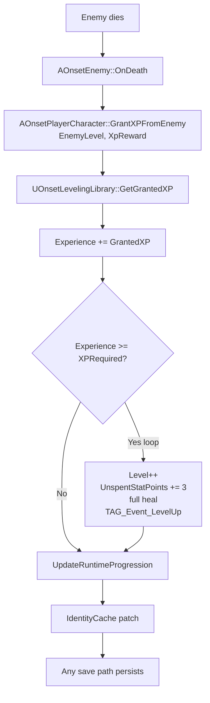

# 📘 **LEVELING SYSTEM**
**File:** `Docs/Player/Leveling_System.md`

---

# **Experience & Leveling**

## **Purpose**

Implement the experience curve, level-ups, and XP persistence from [combat-formulas §12](../combat-formulas.md#12-experience--leveling). Kills grant XP scaled by the grey/yellow/green level-difference multiplier; crossing a level threshold levels the player up (full heal + stat points) and persists the result.

---

## **Responsibilities**

- Own the replicated `Level`, `Experience`, and `UnspentStatPoints` on the player pawn  
- Grant XP on enemy death (including idle/autoplay kills) with the LevelDiff multiplier  
- Compute the per-level XP requirement from the exponential curve  
- Level-up: increment level, full heal, award stat points, fire `TAG_Event_LevelUp`  
- Persist progression write-through so every save path (disconnect, timeout, auto-save, manual) keeps it  

---

## **Non‑Responsibilities**

- Stat allocation (points are banked but not spendable — UI is out of scope, see [combat-system-plan](../combat-system-plan.md))  
- Rebirth/prestige loops (design in [combat-formulas §13](../combat-formulas.md#13-reincarnation--prestige-scaling); N = 0 for now)  
- Combat difficulty scaling (enemy tier scales stats, *not* XP)  
- Quest reward XP / non-combat XP sources  

---

## **Key Concepts**

### **Formula summary (§12)**

```
XPRequired(Level)     = XPBase x (1 + XPGrowth)^(Level-1)        (Loop N = 0)
EnemyBaseXP(Level,Xp) = XpReward if XpReward > 0 else XPRequired(Level) / KillsPerLevel
LevelDiff             = EnemyLevel - PlayerLevel
XPMultiplier =
  0%                                           if LevelDiff <= -GreyThreshold
  ramp 0% -> 100%                              if -GreyThreshold < LevelDiff <= -YellowThreshold
  100%                                         if -YellowThreshold < LevelDiff <= 0
  100% + min(LevelDiff x BonusXPPerOverLevel, MaxBonusXP)   if LevelDiff > 0
GrantedXP             = round(EnemyBaseXP x XPMultiplier)
```

Because the reward is derived from the same curve as the requirement, kills-per-level stays roughly constant across the whole range — `XPGrowth` tunes display magnitude, `KillsPerLevel` tunes pacing, independently.

### **Enemy level vs. difficulty tier**

`DT_EnemyStats.Level` (authored 1-200) is the **XP source level** and is *not* scaled by difficulty tier. Tier only scales enemy MaxHealth/DamageBase. Two spawns of the same row at different tiers grant identical XP.

### **XpReward override**

`XpReward = 0` (default) derives base XP from `XPRequired(Level)/KillsPerLevel`. Setting it to a positive value overrides the base:
- **Bosses**: set higher than the derived value.
- **Summoned minions**: set `0`? No — `0` means *derive*, so set a tiny positive value or accept derived XP; the derive path is the low-XP default for trash.

### **Persistence model**

Progression lives on the **pawn**, not the PlayerState, because the pawn survives autoplay possession and continue-on-disconnect while the PlayerState is destroyed on logout. Every XP grant calls `UOnsetPlayerDataSubsystem::UpdateRuntimeProgression` which patches the identity cache; all downstream saves (`SaveCharacterPreservingIdentity` on disconnect/timeout/auto-save/manual) then persist it without a read-before-write.

---

## **Key Classes**

- **`UOnsetLevelingLibrary`** — static formulas + config accessors (reads `[Onset.Gameplay]` keys from `DefaultEngine.ini`, cached with the sentinel pattern).  
- **`AOnsetPlayerCharacter`** — owns replicated `Level`/`Experience`/`UnspentStatPoints`, `OnProgressionChanged` delegate, `GrantXPFromEnemy()`, `ApplyCharacterProgression()`, level-up processing.  
- **`AOnsetEnemy`** — reads `DT_EnemyStats.Level`/`XpReward` at `ApplyEnemyStats`, grants XP in `OnDeath`.  
- **`UOnsetPlayerDataSubsystem`** — `UpdateRuntimeProgression()` write-through + `SaveCharacterPreservingIdentity()` identity preservation.  
- **`UPlayerXPBarWidget`** — HUD XP bar + level text bound to the pawn's `OnProgressionChanged`.  
- **`UHUDWidget`** — binds the XP bar in `BindToPlayer`.  

---

## **Key Data Structures**

- `FOnsetEnemyStats.Level` (int32, default 1) — authored enemy level.  
- `FOnsetEnemyStats.XpReward` (int32, default 0) — XP override; 0 = derive from curve.  
- `FOnsetFullCharacterData.UnspentStatPoints` (int32, default 0) — banked stat points, persisted.  
- `FOnProgressionChanged` (`NewLevel`, `NewExperience`) — delegate broadcast on any XP/level change.  

---

## **Key Functions**

- `UOnsetLevelingLibrary::GetXPRequired(Level)` — `XPBase x (1+XPGrowth)^(Level-1)`.  
- `UOnsetLevelingLibrary::GetEnemyBaseXP(EnemyLevel, XpReward)` — override or curve-derived base.  
- `UOnsetLevelingLibrary::GetXPMultiplier(PlayerLevel, EnemyLevel)` — grey/yellow/green ramp.  
- `UOnsetLevelingLibrary::GetGrantedXP(PlayerLevel, EnemyLevel, XpReward)` — rounded final grant.  
- `AOnsetPlayerCharacter::GrantXPFromEnemy(EnemyLevel, XpReward)` — server entry point.  
- `AOnsetPlayerCharacter::ApplyCharacterProgression(Level, Experience, StatPoints)` — seed from save.  
- `AOnsetPlayerCharacter::GetXPProgressPercent()` / `GetXPRequiredForNextLevel()` — UI readouts.  
- `UOnsetPlayerDataSubsystem::UpdateRuntimeProgression(...)` — identity-cache write-through.  

---

## **Data Flow**



---

## **Interactions With Other Systems**

- [Player System](./Player_System.md) — pawn owns progression; controller seeds it on select/possess.  
- [NPC AI System](../AI/NPC_AI_System.md) — enemies expose Level/XpReward; kills drive XP.  
- [Spawner System](../AI/Spawner_System.md) — `ApplyEnemyStats(Row, Tier)` carries Level/XpReward.  
- [GAS System](../GAS/GAS_System.md) — `TAG_Event_LevelUp` (`Event.LevelUp`) native tag.  
- [Account System](./Account_System.md) — `FOnsetFullCharacterData` persistence + `SaveCharacterPreservingIdentity`.  
- [UI System](../Gameplay/UI_System.md) — `UPlayerXPBarWidget` in the HUD.  
- [combat-formulas §12](../combat-formulas.md#12-experience--leveling) — the design authority.  

---

## **Replication Rules**

| Data | Rule |
|------|------|
| `Level`, `Experience`, `UnspentStatPoints` | Replicated server → client (`COND_None`) |
| XP grants, level-ups, persistence | Server-only (`HasAuthority()` guarded) |
| `OnProgressionChanged` | Server broadcast; clients read replicated fields |

---

## **Edge Cases**

- **Level cap**: XP stops accumulating at `LevelCap` (200); no over-cap rolls over.  
- **Grey mobs**: `LevelDiff <= -GreyThreshold` grants 0 XP — grants are skipped, nothing persists.  
- **Multi-level-up**: one large grant can cross several thresholds; the while-loop handles it (full heal + points per level).  
- **Autoplay / continue-on-disconnect**: `KillingActor` is the player pawn regardless of possessor, so idle kills grant XP; pawn persists via the AI controller's timeout save.  
- **Cold cache after server restart**: `UpdateRuntimeProgression` seeds the identity cache if the character wasn't loaded in this session.  
- **Missing/legacy enemy rows**: fall back to `Level=1, XpReward=0`.  

---

## **Testing Checklist**

- [ ] Kill an on-level enemy → XP bar fills; level-up at threshold (full heal + 3 stat points).  
- [ ] Kill an over-level enemy → XP bonus capped at `MaxBonusXP`.  
- [ ] Kill a far-under-level enemy → 0 XP.  
- [ ] Boss (`XpReward > 0`) grants exactly `XpReward x XPMultiplier`.  
- [ ] Relog → Level/XP/UnspentStatPoints restored.  
- [ ] Autoplay kills + continue-on-disconnect → XP persists after AI timeout save.  
- [ ] Level 200 → XP stops accumulating.  

---

## **Future Extensions**

- Stat-point allocation UI (spend `UnspentStatPoints`).  
- Rebirth/prestige loops (`(1 + d)^N` loop multiplier, [combat-formulas §13](../combat-formulas.md#13-reincarnation--prestige-scaling)).  
- Quest/completion XP sources.  
- XP gains during zone tiering (whether tier should eventually feed LevelDiff).  
