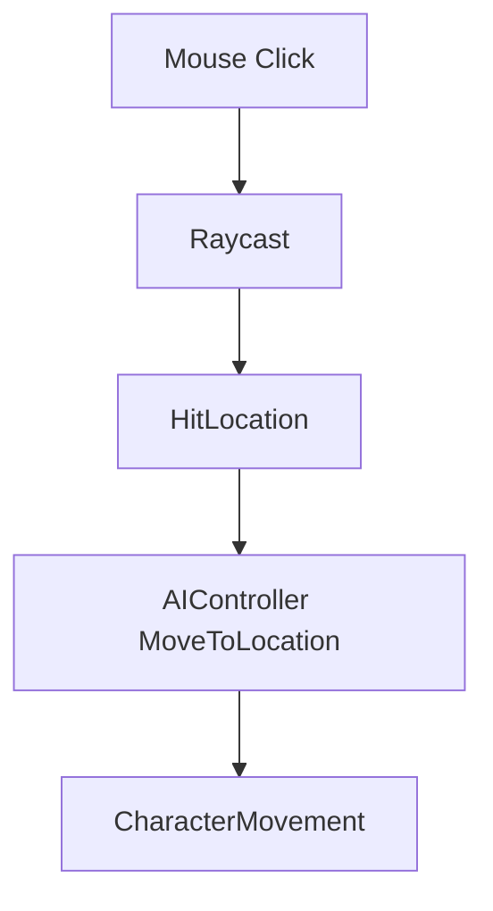

# 📘 **PLAYER SYSTEM DOCUMENT**  
**File:** `/Docs/Player/Player_System.md`

---

# **Player System**

## **Purpose**
Provide top‑down ARPG controls and a UI‑driven PvP toggle that affects targeting and damage rules.

---

## **Responsibilities**
- Handle input  
- Click‑to‑move  
- Click‑to‑target  
- Ability activation  
- PvP toggle UI → PlayerState  
- Autoplay handoff  

---

## **Non‑Responsibilities**
- AI behaviour (handled by [Player AI System](../AI/Player_AI_System.md))  
- NPC spawning (handled by [Spawner System](../AI/Spawner_System.md))  
- Ability definitions (handled by [GAS System](../GAS/GAS_System.md))  

---

## **Key Classes**
- **`APlayerController`** — routes input, sends RPCs, manages PvP toggle  
- **`APlayerState`** — stores and replicates `bIsPvPEnabled`  
- **`UTargetingComponent`** — maintains `CurrentTarget`, validates targets  
- **`UAbilitySystemComponent`** — executes abilities via GAS  

---

## **Click‑to‑Move Flow**



---

## **PvP Toggle Flow**

### UI → PlayerController
Player clicks PvP toggle:

```
OnPvPToggleChanged(bool bEnabled)
```

### PlayerController → Server
```
Server_SetPvPEnabled(bEnabled)
```

### Server → PlayerState
```
bIsPvPEnabled = bEnabled;
```

### Replication → All Clients
`OnRep_PvPEnabled()` updates UI + targeting rules.

---

## **Targeting Integration**
- If [PvP System](../Gameplay/PVP_System.md) disabled → ignore player actors via [Targeting System](../Gameplay/Targeting_System.md)  
- If PvP enabled → include player actors  
- If `CurrentTarget` becomes invalid due to PvP toggle → auto‑select nearest NPC  

## **GAS Integration**
PlayerController routes ability input → ASC via [GAS System](../GAS/GAS_System.md)  
ASC checks PvP rules before applying damage.

## **UI Integration**
[UI System](../Gameplay/UI_System.md) displays:

- PvP ON/OFF  
- Color‑coded indicator  
- Optional tooltip

---

## **Replication**
- PvP flag replicates via `APlayerState`  
- UI updates on `OnRep_PvPEnabled`  
- Server enforces all PvP rules  

---

## **Testing Checklist**
- [ ] Click‑to‑move moves character to target location  
- [ ] Click‑to‑target sets `CurrentTarget` correctly  
- [ ] PvP toggle replicates to all clients  
- [ ] Targeting respects PvP flag (players filtered when OFF)  
- [ ] Player AI autoplay can be enabled/disabled  
- [ ] Works in multiplayer with multiple clients  

---

## **Edge Cases**
- Player toggles PvP mid‑combat  
- Player AI must respect PvP rules  
- Player targeting a player when PvP is turned OFF  
