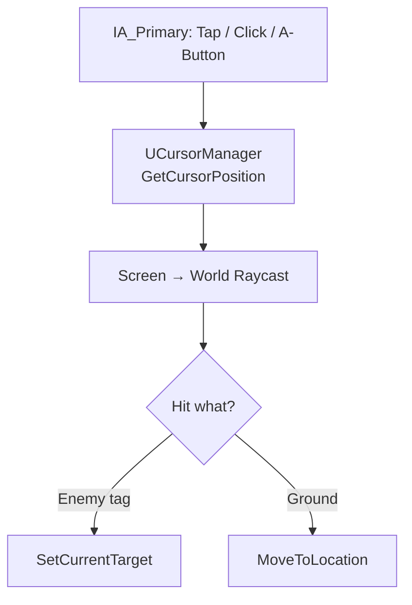

# 📘 **PLAYER SYSTEM DOCUMENT**  
**File:** `/Docs/Player/Player_System.md`

---

# **Player System**

## **Purpose**
Provide top‑down ARPG controls (mouse + touch) and a UI‑driven PvP toggle that affects targeting and damage rules.

---

## **Responsibilities**
- Input handling (mouse + touch + gamepad)  
- Tap/click‑to‑move + WASD + gamepad L-Stick movement  
- Tap/click‑to‑target  
- Gamepad R-Stick software cursor  
- Ability activation (keyboard + touch buttons + gamepad)  
- PvP toggle UI → PlayerState (future)  
- Autoplay handoff (future)  

---

## **Non‑Responsibilities**
- AI behaviour (handled by [Player AI System](../AI/Player_AI_System.md))  
- NPC spawning (handled by [Spawner System](../AI/Spawner_System.md))  
- Ability definitions (handled by [GAS System](../GAS/GAS_System.md))  

---

## **Key Classes**
- **`AOnsetBaseCharacter`** — shared base for player and NPC, inherits `ACharacter`  
- **`AOnsetPlayerCharacter`** — player character, inherits `AOnsetBaseCharacter`, camera lives here  
- **`AOnsetPlayerController`** — routes input, cursor management, targeting, PvP toggle  
- **`AOnsetPlayerState`** — stores and replicates `bIsPvPEnabled` (future)  
- **`UCursorManager`** — provides unified cursor position from mouse, touch, or gamepad R-Stick  
- **`UTargetingComponent`** — data holder for `CurrentTarget`, target validation stub (`IsActorValidTarget`)  
- **`UJoystickWidget`** — touch virtual joystick, injects axis into `IA_Move`  
- **`UGamepadCursorWidget`** — software crosshair overlay for gamepad R-Stick cursor  

---

## **Tap/Click‑to‑Move Flow**

`IA_Primary` (tap/click/A-button) produces a screen-space position that drives the same raycast pipeline. The PlayerController resolves context:



---

## **PvP Toggle Flow** *(planned — not yet implemented)*

### UI → PlayerController
Player clicks PvP toggle:

```
OnPvPToggleChanged(bool bEnabled)
```

### PlayerController → Server
```
Server_SetPvPEnabled(bEnabled)
```

### Server → PlayerState
```
bIsPvPEnabled = bEnabled;
```

### Replication → All Clients
`OnRep_PvPEnabled()` updates UI + targeting rules.

---

## **Targeting Integration**
*(See [Targeting System](../Gameplay/Targeting_System.md) for current state.)*
- If [PvP System](../Gameplay/PVP_System.md) disabled → ignore player actors via [Targeting System](../Gameplay/Targeting_System.md)  
- If PvP enabled → include player actors  
- If `CurrentTarget` becomes invalid due to PvP toggle → auto‑select nearest NPC  

## **GAS Integration** *(planned)*
PlayerController routes ability input → ASC via [GAS System](../GAS/GAS_System.md)  
ASC checks PvP rules before applying damage.

## **UI Integration** *(partial — see [UI System](../Gameplay/UI_System.md))*
[UI System](../Gameplay/UI_System.md) displays:

- Virtual joystick (touch) [done]  
- Gamepad cursor overlay [done]  
- PvP ON/OFF [planned]  
- Color‑coded indicator [planned]  

---

## **Replication** *(planned)*
- PvP flag replicates via `AOnsetPlayerState`  
- UI updates on `OnRep_PvPEnabled`  
- Server enforces all PvP rules  

---

## **Testing Checklist**
- [x] Tap/click‑to‑move moves character to target location (mouse + touch)  
- [ ] Tap/click‑to‑target sets `CurrentTarget` correctly (mouse + touch)  
- [ ] PvP toggle replicates to all clients *(planned)*  
- [ ] Targeting respects PvP flag (players filtered when OFF) *(planned)*  
- [ ] Player AI autoplay can be enabled/disabled *(planned)*  
- [ ] Works in multiplayer with multiple clients *(planned)*  

---

## **Edge Cases** *(notes for planned features)*
- Player toggles PvP mid‑combat  
- Player AI must respect PvP rules  
- Player targeting a player when PvP is turned OFF  
