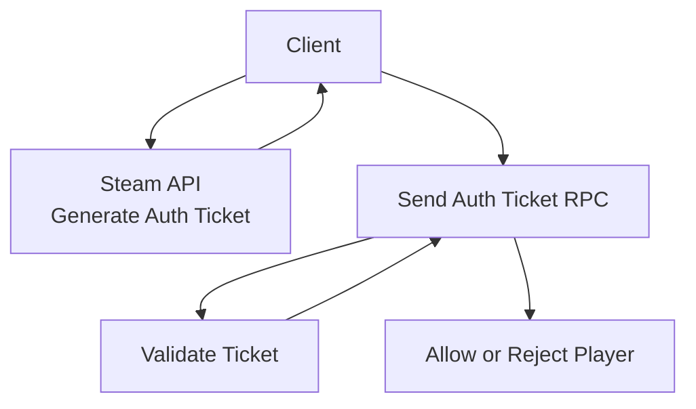

# 📘 **STEAM INTEGRATION SYSTEM**  
**File:** `/Docs/Steam/Steam_Integration_System.md`

---

# **Steam Integration System**

## **Purpose**
Provide **Steam‑authenticated multiplayer** using the Online Subsystem Steam (OSS), enabling:

- Steam user authentication  
- Auth ticket generation  
- Server‑side ticket verification  
- Steam‑authenticated dedicated server sessions  
- Steam‑based server discovery (optional)  

This system ensures that all multiplayer interactions are tied to verified Steam identities.

---

## **Responsibilities**
- Initialize the Steam Online Subsystem  
- Retrieve Steam user IDs and display names  
- Generate Steam auth tickets on the client  
- Send auth tickets to the server for verification  
- Validate tickets server‑side  
- Register dedicated servers with Steam  
- Support Steam‑authenticated session creation and joining  

---

## **Non‑Responsibilities**
- Matchmaking UI  
- Friends list integration  
- Achievements, stats, cloud saves  
- Anti‑cheat  
- Voice chat  
- Inventory or microtransactions  

---

## **Key Classes**

### **`IPlatformAuth` (platform abstraction interface)**
- Wraps platform-specific auth validation
- Provides clean C++ API: `ValidateTicket(AuthTicket)` → `FPlatformAuthResult`
- Implemented by `FSteamAuth` (current), `FXboxAuth` (future), `FPSNAuth` (future)

### **`AOnsetPlayerController`**
- Requests auth ticket from Steam via `IOnlineSubsystem::Get()->GetIdentityInterface()`
- Sends ticket to server via RPC: `Server_SendAuthTicket(const FString& AuthTicket)`

### **`AOnsetGameModeBase`**
- Validates auth tickets server-side
- **SteamID Extraction**: Calls `ISteamGameServer::BeginAuthSession()` to convert auth ticket → numeric SteamID64
- Stores SteamID as `FString` on `AOnsetPlayerState::PlayerPlatformID`
- Sets `AOnsetPlayerState::PlayerPlatform = "Steam"`
- Triggers account load via `UOnsetPlayerDataSubsystem::LoadAccount()`

### **`UOnsetPlayerDataSubsystem`** (DS only)
- World subsystem that owns the `IPlayerDataStore`
- Loads/saves account and character data keyed by `(Platform, PlatformID)`
- Called from `GameMode::PostLogin()` after successful auth

---

## **Key Functions**

### **Client‑Side**
- `RequestAuthTicket()` — calls `IOnlineIdentity::GetAuthToken(0)` 
- `Server_SendAuthTicket(const FString& AuthTicket)` — reliable RPC

### **Server‑Side**
- `ValidateAuthTicket(APlayerController*, const FString& AuthTicket)` — validates via `ISteamGameServer::BeginAuthSession()`
- `ExtractSteamID(FString AuthTicket)` → `FString SteamID64` — gets numeric SteamID
- `PostLogin()` — triggers `UOnsetPlayerDataSubsystem::LoadAccount(Platform, PlatformID)`
- `RegisterServerWithSteam()` — registers dedicated server with Steam
- `HandleAuthTimeout()` — disconnects client if ticket validation exceeds 10s

---

## **Data Flow Diagram**

---

## **Interactions With Other Systems**

### **[Multiplayer System](../Multiplayer/Multiplayer_System.md)**
- Steam auth is required before joining  
- Dedicated server uses Steam for registration  

### **[Account System](../Player/Account_System.md)**
- Provides the platform identity `(Platform, PlatformID)` that anchors all persistent data  
- SteamID extracted via `ISteamGameServer::BeginAuthSession()` becomes the primary key for the account row  

### **[Player System](../Player/Player_System.md)**
- PlayerState stores Steam ID and platform name for persistence lookup  
- Triggers account load after successful auth  

### **[UI System](../Gameplay/UI_System.md)**
- Displays Steam name in character select  
- Shows connection/auth errors  

---

## **Replication Rules**
- Steam IDs replicate via PlayerState  
- Auth tickets **never** replicate  
- Server‑side validation only  

---

## **Edge Cases**
- Steam not running  
- Invalid or expired auth ticket  
- Ticket validation timeout  
- Dedicated server fails to register  
- Client disconnects mid‑auth  

---

## **Testing Checklist**
- [ ] Client generates auth ticket  
- [ ] Server validates ticket  
- [ ] Invalid tickets are rejected  
- [ ] Dedicated server registers with Steam  
- [ ] Clients can join Steam‑authenticated sessions  
- [ ] Works with multiple clients  

---

## **Future Extensions**
- Steam server browser  
- Steam friends list integration  
- Steam achievements  
- Steam stats and leaderboards  